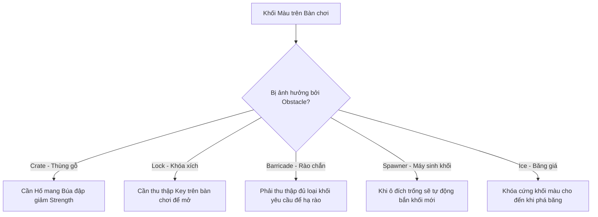
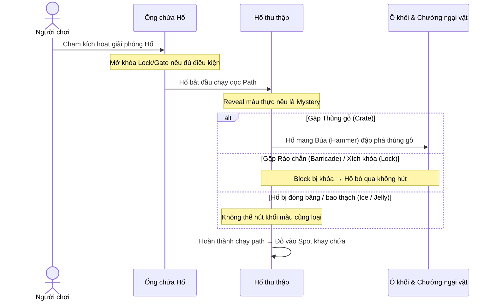
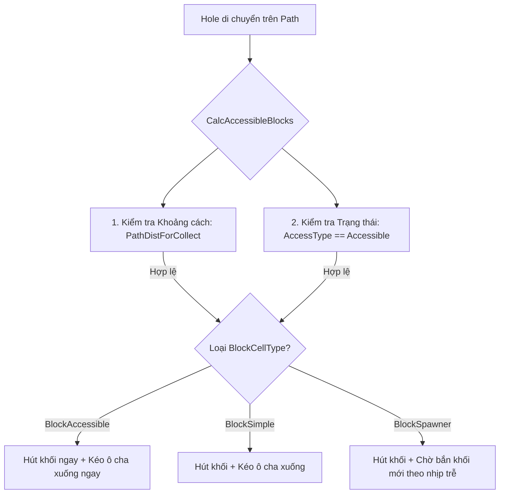
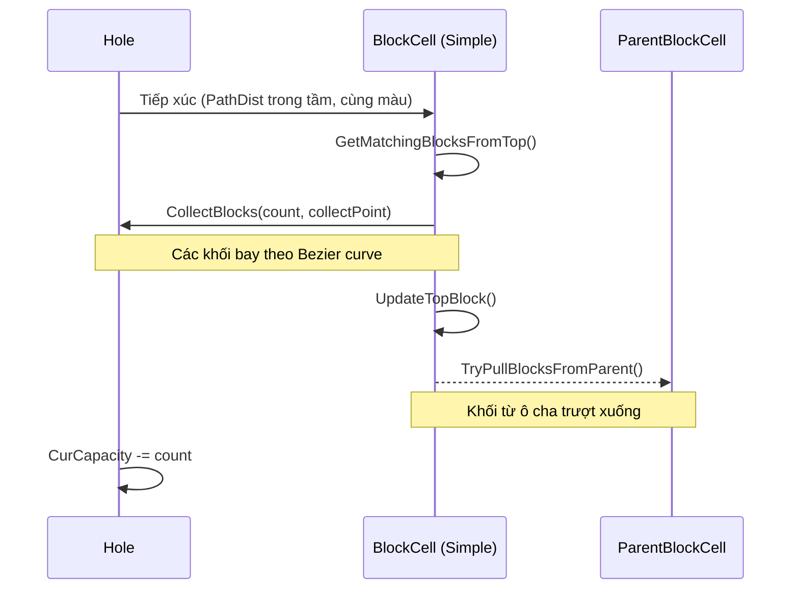
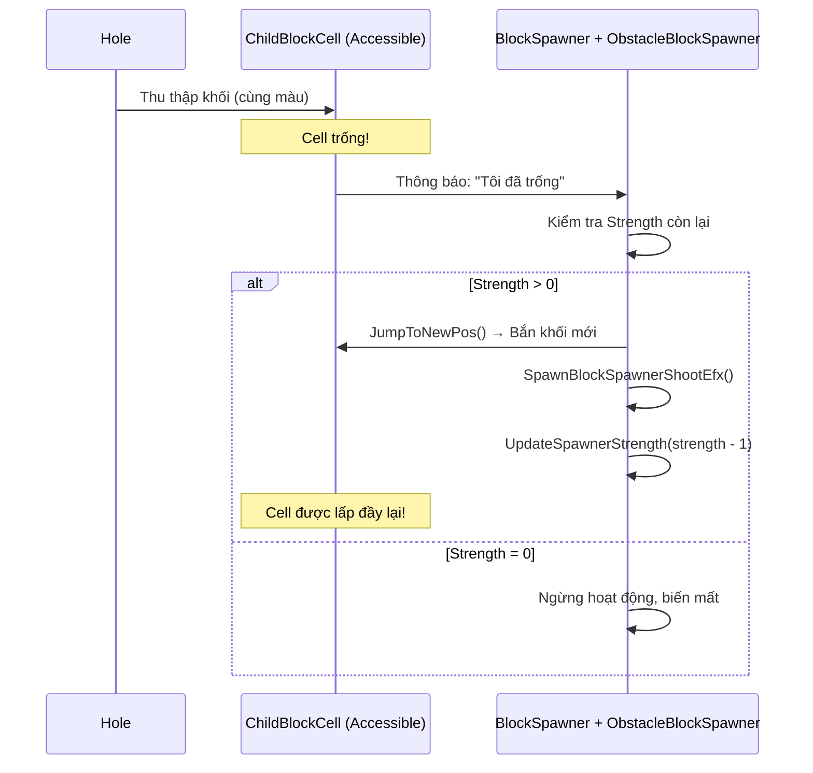
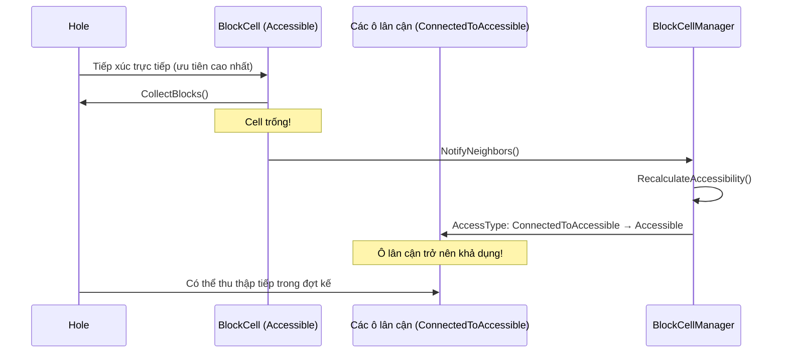
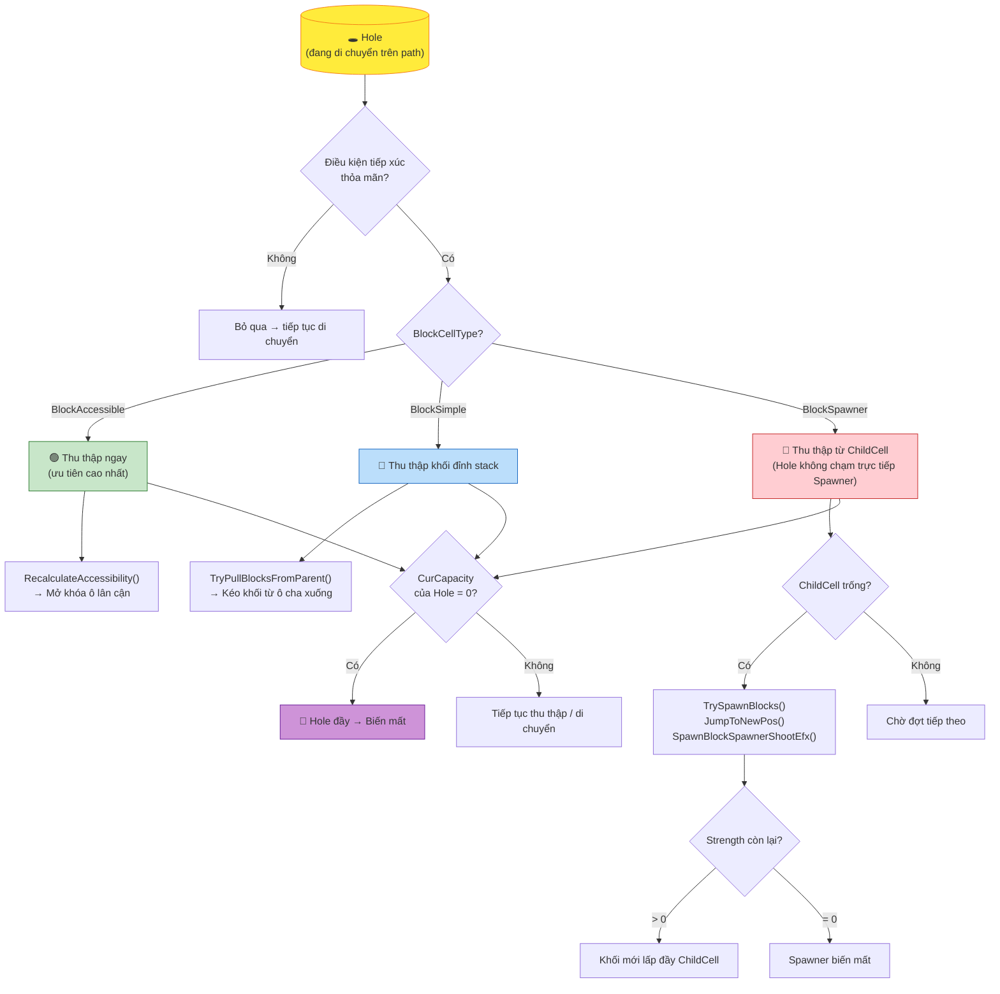
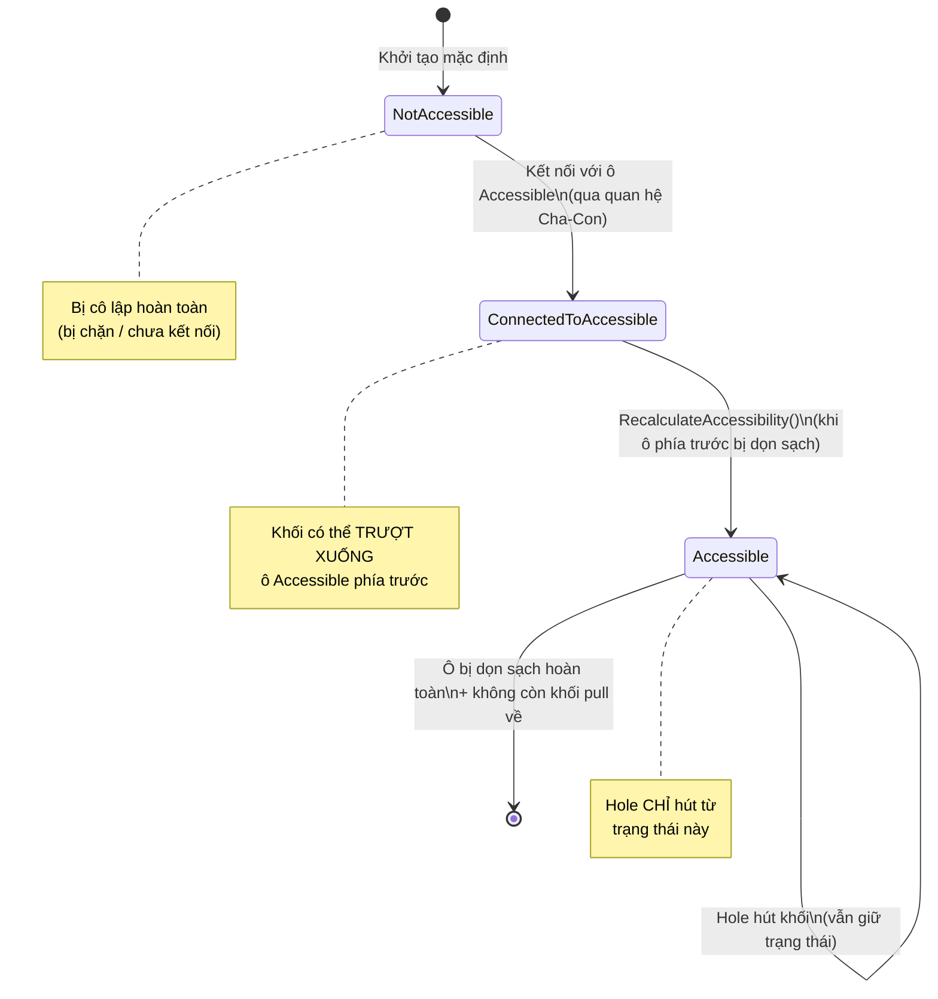

# 📋 TODO — Các tính năng còn thiếu so với tài liệu thiết kế

> **Ngày tạo**: 2026-06-18 | **Cập nhật**: 2026-06-19  
> **Nguồn tham chiếu & Tổng hợp**: `obstacle_roles.md`, `block_cell_priority_rules.md`, `blockcell_accesstype_examples.md`, `hole_vs_blockcell_by_type.md`, `block_cell_types_rules.md`  
> **Phương pháp**: So sánh mô tả trong tài liệu thiết kế với source code thực tế trong `Assets/Project/Scripts/`

---

## ⚠️ NHẬN ĐỊNH TỔNG QUAN

**Phần lớn hệ thống gameplay mô tả trong tài liệu thiết kế CHƯA ĐƯỢC TRIỂN KHAI.**

Các file source code hiện tại hầu hết là **stub** (khung rỗng):

| File hiện có | Dòng code | Trạng thái |
|---|:---:|---|
| `BlockCell.cs` | **12 dòng** | Chỉ có field `PathDistForCollect` và getter |
| `Block.cs` | **7 dòng** | Chỉ có field `ParentHole` |
| `BlockCellData.cs` | 32 dòng | ✅ Đã có enum `BlockCellType` + data class |
| `BlockCellController.cs` | 51 dòng | Chỉ có `AllBlockCells` list + `InitializeCellDistances()` |
| `Hole.cs` | 209 dòng | Có Bezier movement + distance check cơ bản, **nhưng chưa có logic thu thập khối** |

**Đường dẫn file thực tế** khác với đường dẫn trong tài liệu:
- ✅ Thực tế: `Assets/Project/Scripts/GamePlay/`, `Assets/Project/Scripts/Data/`, `Assets/Project/Scripts/Controller/`
- ❌ Tài liệu ghi: `Assets/Scripts/Assembly-CSharp/` (không tồn tại)

---

## Chú thích trạng thái

| Ký hiệu | Ý nghĩa |
|:---:|---|
| ❌ | **Chưa triển khai** — Hoàn toàn chưa có trong code |
| ⚠️ | **Triển khai chưa đầy đủ** — Có một phần nhưng thiếu logic theo tài liệu |
| ✅ | **Đã triển khai đủ** — Phù hợp với mô tả tài liệu |

---

## PHẦN A — CẤU TRÚC DỮ LIỆU & ENUM CÒN THIẾU

### ✅ A.1 — Enum `BlockCellAccessType`

- **Tài liệu yêu cầu** (cả 3 file): Enum gồm `Accessible`, `ConnectedToAccessible`, `NotAccessible`
- **Hiện trạng**: ✅ Đã có trong codebase tại `BlockCellAccessType.cs`
- **Việc cần làm**: Đã hoàn thành.

### ❌ A.2 — Enum `HoleType` (Màu sắc Hole)

- **Tài liệu yêu cầu**: `CurHoleType` trên Hole, `TopHoleType` trên BlockCell — dùng để so khớp màu
- **Hiện trạng**: `Hole.cs` chỉ có `_ColorID` (int), không có enum HoleType. Không có cơ chế so khớp màu
- **Việc cần làm**: Tạo hoặc hoàn thiện enum `HoleType` (nếu đã tồn tại ở nơi khác) để phân biệt các loại Hole theo màu

---

## PHẦN B — BLOCK.CS (Hiện tại: 7 dòng stub)

### ⚠️ B.1 — Dữ liệu cơ bản của Block

- **Tài liệu yêu cầu**: Mỗi Block có màu sắc (`BlockCol`/`HoleType`), trạng thái top/not-top
- **Hiện trạng**: Đã có `ColorID`, `OwnerCell`, `Init()`, `ApplyColorFromDatabase()`. Chưa có trạng thái `IsTop`.
- **Việc cần làm**:
  - `[x]` `ColorID` (thay cho màu sắc)
  - `[x]` Reference tới `BlockCell` chứa khối này (`OwnerCell`)
  - `[ ]` `IsTop` — trạng thái khối đỉnh

### ❌ B.2 — `SetAsTop()` / `SetAsNotTop()`

- **Tài liệu yêu cầu**: Khối đỉnh được highlight, các khối dưới bị ẩn/mờ
- **Hiện trạng**: Không tồn tại
- **Việc cần làm**: Thêm method thay đổi visual state (scale, material, visibility)

### ❌ B.3 — `JumpToNewPos()`

- **Tài liệu yêu cầu**: Hoạt ảnh nhảy khi Spawner bắn khối mới
- **Hiện trạng**: Không tồn tại
- **Việc cần làm**: Thêm method animation di chuyển khối từ Spawner đến ô đích (dùng LeanTween/DOTween)

### ❌ B.4 — `SetPathDistForCollect()`

- **Tài liệu yêu cầu**: Mỗi block có thể tự biết khoảng cách path
- **Hiện trạng**: Không tồn tại (chỉ có trên `BlockCell`)
- **Việc cần làm**: Đánh giá và thêm nếu cần

### ❌ B.5 — Visual State Management

- **Tài liệu yêu cầu**: `SetVisible()`, quản lý hiển thị khối
- **Hiện trạng**: Không tồn tại
- **Việc cần làm**: Thêm các method quản lý hiển thị (show/hide, alpha, scale)

---

## PHẦN C — BLOCKCELL.CS (Hiện tại: 12 dòng stub)

> **Đây là file cần nhiều việc nhất** — gần như toàn bộ logic gameplay core nằm ở đây

### ⚠️ C.1 — Thuộc tính cơ bản của BlockCell

- **Tài liệu yêu cầu**: `CellType`, `AccessType`, `CurBlocks` (stack), `TopBlock`, `TopHoleType`, `CurVisibleBlockCt`
- **Hiện trạng**: Đã có `CellType`, `AccessType`, `CurBlocks`, `ParentBlockCells`, `ChildBlockCells`. Thiếu `TopBlock`, `TopHoleType`, `CurVisibleBlockCt`.
- **Việc cần làm**:
  - `[x]` BlockCellType CellType
  - `[x]` BlockCellAccessType AccessType
  - `[x]` List<Block> CurBlocks
  - `[ ]` Block TopBlock → Property trả về khối đỉnh
  - `[ ]` HoleType TopHoleType → Màu của khối đỉnh (so khớp với Hole)
  - `[ ]` int CurVisibleBlockCt → Số khối hiển thị

### ❌ C.2 — Quan hệ Parent-Child giữa các BlockCell

- **Tài liệu yêu cầu**: `ParentBlockCells` (List) và `ChildBlockCells` (List) tạo cấu trúc chuỗi cây
- **Hiện trạng**: Không tồn tại
- **Việc cần làm**: Thêm `List<BlockCell> ParentBlockCells` và `List<BlockCell> ChildBlockCells`, thiết lập khi khởi tạo màn chơi

### ❌ C.3 — `GetMatchingBlocksFromTop()`

- **Tài liệu yêu cầu**: Đếm số khối liên tiếp cùng màu từ đỉnh stack
- **Hiện trạng**: Không tồn tại
- **Việc cần làm**: Implement logic duyệt `CurBlocks` từ trên xuống, đếm khối liên tiếp cùng `HoleType`

### ❌ C.4 — `CollectBlocks(count, collectPoint)`

- **Tài liệu yêu cầu**: Lấy khối ra khỏi stack, tạo animation bay theo Bezier curve đến Hole, stagger delay giữa các khối
- **Hiện trạng**: Không tồn tại
- **Việc cần làm**: Implement:
  1. Xóa `count` khối từ đỉnh `CurBlocks`
  2. Animate từng khối bay đến `collectPoint` (Bezier curve)
  3. Stagger delay giữa các khối
  4. Callback khi hoàn tất

### ❌ C.5 — `UpdateTopBlock()`

- **Tài liệu yêu cầu**: Khi khối đỉnh bị hút, khối bên dưới trở thành top → có thể thay đổi màu yêu cầu
- **Hiện trạng**: Không tồn tại
- **Việc cần làm**: Implement logic cập nhật khối đỉnh mới, gọi `SetAsTop()` trên block mới

### ❌ C.6 — `TryPullBlocksFromParent()`

- **Tài liệu yêu cầu**: Khi ô con trống, kéo khối từ ô cha trượt xuống lấp đầy
- **Hiện trạng**: Không tồn tại
- **Việc cần làm**: Implement logic:
  1. Kiểm tra `ParentBlockCells` có khối không
  2. Lấy khối từ ô cha
  3. Animate khối trượt xuống
  4. Cập nhật cả ô cha và ô con

### ❌ C.7 — `TrySpawnBlocks()` (cho BlockSpawner)

- **Tài liệu yêu cầu**: Khi ô đích trống, Spawner sinh khối mới, bắn theo `SpawnerDirectionAngleZ`, animation `JumpToNewPos`
- **Hiện trạng**: Không tồn tại
- **Việc cần làm**: Implement logic:
  1. Kiểm tra Strength còn lại
  2. Tạo khối mới với màu đã định sẵn
  3. Animate `JumpToNewPos()` theo hướng bắn
  4. Giảm Strength, cập nhật hiển thị

### ❌ C.8 — Spawner-specific fields

- **Tài liệu yêu cầu**: `SpawnerDirectionAngleZ`, `SpawnWaitTimeAfterFill`, `SpawnerIndicatorRenderer`
- **Hiện trạng**: `SpawnerDirectionAngleZ` chỉ có trong `BlockCellData`, không có runtime
- **Việc cần làm**: Thêm các field spawner-specific vào `BlockCell` hoặc tạo sub-class riêng

---

## PHẦN D — BLOCKCELLCONTROLLER.CS (Hiện tại: 51 dòng, thiếu phần quản lý)

> Tài liệu gọi đây là `BlockCellManager` — trong code hiện tại là `BlockCellController`

### ❌ D.1 — `CalcAccessibleBlocks()` / `GetAccessibleBlocksForHole()`

- **Tài liệu yêu cầu**: Quét tất cả cell, lọc ra các ô khả dụng cho Hole dựa trên khoảng cách + AccessType
- **Hiện trạng**: Chỉ có `GetCellByIndex()` — không lọc theo AccessType hay màu sắc
- **Việc cần làm**: Implement method lọc cell cho Hole theo:
  1. `PathDistForCollect` trong tầm
  2. `AccessType == Accessible`
  3. `TopHoleType` cùng màu với Hole

### ❌ D.2 — `RecalculateAccessibility()` (Thuật toán DFS)

- **Tài liệu yêu cầu**: Khi ô `BlockAccessible` trống, chạy DFS/BFS cập nhật trạng thái accessibility cho các ô liên kết phía sau (`ConnectedToAccessible` → `Accessible`)
- **Hiện trạng**: Không tồn tại
- **Việc cần làm**: Implement thuật toán DFS cập nhật trạng thái truy cập trên toàn bộ chuỗi cell

### ❌ D.3 — Quản lý quan hệ Parent-Child cells

- **Tài liệu yêu cầu**: Controller biết cấu trúc cây của tất cả cells
- **Hiện trạng**: Chỉ có danh sách phẳng `AllBlockCells`
- **Việc cần làm**: Thêm logic xây dựng và quản lý cấu trúc cây khi khởi tạo màn chơi

---

## PHẦN E — HOLE.CS (Hiện tại: 209 dòng, có cơ bản nhưng thiếu nhiều)

### ⚠️ E.1 — Logic thu thập khối (Core Gameplay Loop)

- **Tài liệu yêu cầu**: Khi Hole đến gần BlockCell → kiểm tra 5 điều kiện → thu thập khối → cập nhật capacity
- **Hiện trạng**: `TryCheckDistanceRealTime()` chỉ kiểm tra khoảng cách và log, **KHÔNG thực sự thu thập khối**
  ```csharp
  // Hiện tại chỉ log:
  Debug.Log($"[Match Triggered] Hole reached Cell {NextAccessibleCellIdx}...");
  NextAccessibleCellIdx++;
  // → Không gọi CollectBlocks, không kiểm tra màu, không trừ capacity
  ```
- **Việc cần làm**: Thêm vào `TryCheckDistanceRealTime()`:
  1. Kiểm tra cùng màu (`TopHoleType == CurHoleType`)
  2. Kiểm tra `CurCapacity > 0`
  3. Kiểm tra `AccessType == Accessible`
  4. Kiểm tra không bị chướng ngại vật
  5. Gọi `BlockCell.CollectBlocks()`
  6. Trừ `CurCapacity`

### ❌ E.2 — `CurHoleType` / Quản lý màu sắc Hole

- **Tài liệu yêu cầu**: `CurHoleType` dùng để so khớp màu với khối
- **Hiện trạng**: Chỉ có `_ColorID` (int) — không có enum, không có logic so khớp
- **Việc cần làm**: Chuyển sang dùng `HoleType` enum hoặc kết nối `_ColorID` với hệ thống so khớp

### ❌ E.3 — `CurCapacity` & Quản lý sức chứa

- **Tài liệu yêu cầu**: `CurCapacity` giảm mỗi khi thu thập, khi = 0 → Hole đầy → chuỗi biến mất
- **Hiện trạng**: Có field `_holeCapacity` nhưng **không bao giờ thay đổi** trong runtime
- **Việc cần làm**: Implement logic trừ capacity mỗi lần collect + trigger vanish khi hết

### ❌ E.4 — Chuỗi biến mất khi Hole đầy (Vanish Sequence)

- **Tài liệu yêu cầu**: Hoạt ảnh biến mất (scale down + fade + particle burst)
- **Hiện trạng**: Không tồn tại
- **Việc cần làm**: Implement animation sequence khi `CurCapacity == 0`

### ❌ E.5 — `HoleBlockCollectionEfx` (Hiệu ứng bounce/squish)

- **Tài liệu yêu cầu**: Hole co giãn bounce/squish khi thu thập mỗi khối
- **Hiện trạng**: Không tồn tại
- **Việc cần làm**: Thêm `LeanTween.scale()` punch animation khi collect

### ❌ E.6 — Fill Indicator UI

- **Tài liệu yêu cầu**: Hiển thị mức đầy của Hole, cập nhật mỗi khi thu thập
- **Hiện trạng**: Không tồn tại
- **Việc cần làm**: Tạo UI component hiển thị fill level

---

## PHẦN F — FILE CẦN TẠO MỚI

### ❌ F.1 — `ObstacleBlockSpawner.cs`

- **Tài liệu yêu cầu**: Component quản lý Strength của Spawner, hiển thị số, xử lý logic bắn
- **Hiện trạng**: **File không tồn tại**
- **Việc cần làm**: Tạo mới với:
  - `Strength` field (int)
  - `UpdateSpawnerStrength(int newStrength)` — cập nhật TextMeshPro hiển thị
  - `SpawnBlockSpawnerShootEfx()` — particle effect khi bắn
  - Logic deactivate khi Strength = 0

### ❌ F.2 — `ObstacleBlock.cs`

- **Tài liệu yêu cầu**: Chướng ngại vật khóa cell, ngăn Hole thu thập
- **Hiện trạng**: **File không tồn tại**
- **Việc cần làm**: Tạo component chướng ngại vật với logic khóa/mở BlockCell

### ❌ F.3 — `SpawnerIndicator.cs`

- **Tài liệu yêu cầu**: Hiển thị preview màu khối sắp sinh ra trên Spawner
- **Hiện trạng**: **File không tồn tại**
- **Việc cần làm**: Tạo component hiển thị indicator với cập nhật màu tự động

### ❌ F.4 — `BlockCellProxy.cs` (Editor Tool)

- **Tài liệu yêu cầu**: Data proxy trong editor, config `SpawnerDirectionAngleZ`, `ChildCellProxies`
- **Hiện trạng**: **File không tồn tại**
- **Việc cần làm**: Tạo editor tool để thiết kế màn chơi trực quan

---

## PHẦN G — HIỆU ỨNG & ÂM THANH

### ❌ G.1 — Particle VFX khi khối bay đến Hole

- **Tài liệu yêu cầu**: Phát particle effect mỗi khi khối bay đến Hole
- **Hiện trạng**: Không tồn tại
- **Việc cần làm**: Tạo ParticleSystem prefab + trigger mỗi khi collect thành công

### ❌ G.2 — Sound Effect thu thập khối

- **Tài liệu yêu cầu**: Phát sound effect khi thu thập
- **Hiện trạng**: `SoundController.cs` tồn tại nhưng không có sound cho block collection
- **Việc cần làm**: Thêm AudioClip + play logic vào `SoundController`

### ❌ G.3 — `SpawnBlockSpawnerShootEfx()` (VFX bắn khối)

- **Tài liệu yêu cầu**: Hiệu ứng particle khi Spawner bắn khối
- **Hiện trạng**: Không tồn tại
- **Việc cần làm**: Tạo particle effect tại vị trí Spawner

### ❌ G.4 — Bezier Curve Animation cho block collection

- **Tài liệu yêu cầu**: Khối bay theo đường Bezier curve đến Hole
- **Hiện trạng**: Không có logic collection animation nào
- **Việc cần làm**: Implement đường cong Bezier cho animation khối bay

---

## 📊 BẢNG TỔNG HỢP THEO ĐỘ ƯU TIÊN

### 🔴 Ưu tiên CAO — Core Gameplay (Không có thì game không chơi được)

| # | Feature | File | Trạng thái |
|:---:|---|---|:---:|
| C.1 | Thuộc tính cơ bản BlockCell (CellType, CurBlocks, TopBlock...) | `BlockCell.cs` | ❌ |
| C.2 | Quan hệ Parent-Child BlockCells | `BlockCell.cs` | ❌ |
| C.4 | `CollectBlocks()` — Thu thập khối | `BlockCell.cs` | ❌ |
| C.5 | `UpdateTopBlock()` — Cập nhật khối đỉnh | `BlockCell.cs` | ❌ |
| C.3 | `GetMatchingBlocksFromTop()` — Đếm khối cùng màu | `BlockCell.cs` | ❌ |
| C.6 | `TryPullBlocksFromParent()` — Dòng chảy khối | `BlockCell.cs` | ❌ |
| E.1 | Logic thu thập khối trong Hole | `Hole.cs` | ⚠️ |
| E.3 | Quản lý CurCapacity | `Hole.cs` | ❌ |
| A.1 | Enum `BlockCellAccessType` | Tạo mới | ❌ |
| D.1 | `CalcAccessibleBlocks()` | `BlockCellController.cs` | ❌ |
| D.2 | `RecalculateAccessibility()` (DFS) | `BlockCellController.cs` | ❌ |
| B.1 | Dữ liệu cơ bản Block (màu, trạng thái) | `Block.cs` | ❌ |
| B.2 | `SetAsTop()` / `SetAsNotTop()` | `Block.cs` | ❌ |

### 🟡 Ưu tiên TRUNG BÌNH — Spawner System

| # | Feature | File | Trạng thái |
|:---:|---|---|:---:|
| C.7 | `TrySpawnBlocks()` | `BlockCell.cs` | ❌ |
| C.8 | Spawner fields (direction, delay) | `BlockCell.cs` | ❌ |
| F.1 | `ObstacleBlockSpawner.cs` | Tạo mới | ❌ |
| F.2 | `ObstacleBlock.cs` | Tạo mới | ❌ |
| B.3 | `JumpToNewPos()` | `Block.cs` | ❌ |
| D.3 | Quản lý cấu trúc cây cells | `BlockCellController.cs` | ❌ |

### 🟢 Ưu tiên THẤP — Polish & Effects

| # | Feature | File | Trạng thái |
|:---:|---|---|:---:|
| E.4 | Hole vanish animation | `Hole.cs` | ❌ |
| E.5 | `HoleBlockCollectionEfx` (bounce/squish) | `Hole.cs` | ❌ |
| E.6 | Fill Indicator UI | `Hole.cs` + UI | ❌ |
| G.1 | Particle VFX thu thập | VFX mới | ❌ |
| G.2 | Sound effect thu thập | `SoundController.cs` | ❌ |
| G.3 | Spawner shoot VFX | VFX mới | ❌ |
| G.4 | Bezier curve animation | `BlockCell.cs` | ❌ |
| F.3 | `SpawnerIndicator.cs` | Tạo mới | ❌ |
| F.4 | `BlockCellProxy.cs` (Editor) | Tạo mới | ❌ |
| E.2 | HoleType enum / màu sắc | `Hole.cs` | ❌ |
| A.2 | HoleType enum hoàn chỉnh | Tạo mới/cập nhật | ❌ |
| B.4 | `SetPathDistForCollect()` | `Block.cs` | ❌ |
| B.5 | Visual State Management | `Block.cs` | ❌ |

---

## ✅ NHỮNG GÌ ĐÃ CÓ (Không cần làm lại)

| Feature | File | Chi tiết |
|---|---|---|
| Enum `BlockCellType` (4 giá trị: Empty, BlockSpawner, BlockSimple, BlockAccessible) | `BlockCellData.cs` | ✅ Đủ, có thêm `Empty` so với tài liệu |
| `BlockCellData` class (dữ liệu config) | `BlockCellData.cs` | ✅ Có đủ: CellPos, CellRot, CellScale, BlockColor, PendingBlockDataArr, PathDistForCollect, SpawnerDirectionAngleZ |
| `PendingBlockData` (BlockCol, StackCt) | `PendingBlockData.cs` | ✅ Đủ |
| `HoleData` (_ColorID, _holdState, _holdType, _holeCapacity) | `HoleData.cs` | ✅ Đủ |
| `PathDistForCollect` field trên BlockCell | `BlockCell.cs` | ✅ Có |
| `InitializeCellDistances()` (tính PathDist từ Spline) | `BlockCellController.cs` | ✅ Có |
| `AllBlockCells` list + sort by distance | `BlockCellController.cs` | ✅ Có |
| Hole Bezier movement (BezierWalker) | `Hole.cs` | ✅ Có |
| Hole khoảng cách real-time check | `Hole.cs` | ⚠️ Có nhưng chưa trigger collect |
| Hole → Spot system (FlyToEmptySpot) | `Hole.cs` + `Spot.cs` | ✅ Có |
| `GetCurPathTravelDist()` | `Hole.cs` | ✅ Có |

---

## 📐 THỨ TỰ TRIỂN KHAI ĐỀ XUẤT

```
Giai đoạn 1 — Nền tảng dữ liệu
├── A.1  Tạo enum BlockCellAccessType
├── A.2  Hoàn thiện HoleType enum
├── B.1  Mở rộng Block.cs (màu sắc, trạng thái)
└── C.1  Mở rộng BlockCell.cs (thuộc tính cơ bản)

Giai đoạn 2 — Cấu trúc cây & Accessibility
├── C.2  Quan hệ Parent-Child
├── D.3  Xây dựng cấu trúc cây trong Controller
├── D.1  CalcAccessibleBlocks()
└── D.2  RecalculateAccessibility() (DFS)

Giai đoạn 3 — Core Collection Loop
├── B.2  SetAsTop() / SetAsNotTop()
├── C.3  GetMatchingBlocksFromTop()
├── C.4  CollectBlocks() + Animation
├── C.5  UpdateTopBlock()
├── E.1  Hoàn thiện logic thu thập trong Hole
└── E.3  CurCapacity management

Giai đoạn 4 — Dòng chảy & Spawner
├── C.6  TryPullBlocksFromParent()
├── C.7  TrySpawnBlocks()
├── B.3  JumpToNewPos()
├── F.1  ObstacleBlockSpawner.cs
└── F.2  ObstacleBlock.cs

Giai đoạn 5 — Polish & Effects
├── E.4  Hole vanish animation
├── E.5  HoleBlockCollectionEfx
├── G.1-G.4  VFX & Sound effects
├── E.6  Fill Indicator UI
├── F.3  SpawnerIndicator.cs
└── F.4  BlockCellProxy.cs (Editor)
```

---

## PHẦN H — CHI TIẾT CÁC CƠ CHẾ CHƯỚNG NGẠI VẬT (OBSTACLES)
*(Tổng hợp từ `obstacle_roles.md`)*

Trong **Into the Hole**, các chướng ngại vật (**Obstacles**) đóng vai trò cốt lõi trong việc tăng độ khó, đa dạng hóa chiến thuật và tạo ra các câu đố màu sắc phức tạp. Chúng được chia làm 3 nhóm chính dựa trên thực thể mà chúng tác động:
1. **Chướng ngại vật tại Ống chứa Hố (Pipe Obstacles)**
2. **Chướng ngại vật tại Khối màu (Block Obstacles)**
3. **Chướng ngại vật trực tiếp trên Hố (Hole Obstacles)**

### H.1 — Chướng ngại vật tại Ống chứa Hố (Pipe Obstacles)
*Được định nghĩa trong [PipeObstacleType.cs](file:///d:/Loc/Other/Ducjd/intotheHole/ExportedProject/Assets/Scripts/Assembly-CSharp/PipeObstacleType.cs) và quản lý bởi các lớp như `ObstaclePipe`.*

Các chướng ngại vật này nằm ở hàng chờ cổng ống xuất phát, ảnh hưởng trực tiếp đến khả năng giải phóng và thứ tự xuất phát của các Hố thu thập.

| Loại Chướng Ngại Vật | Tác dụng trong Game | Cách giải quyết / Vượt qua | Lớp xử lý liên quan |
| :--- | :--- | :--- | :--- |
| **Lock (Khóa xích ống)** | Dùng xích sắt khóa đầu ống chứa Hố, không cho phép người chơi chạm giải phóng Hố đứng đầu. | Thu thập các **Chìa khóa (Key)** nằm trên các ô khối của bàn chơi. Chìa khóa sẽ bay về để mở khóa ống. | [ObstaclePipeLock.cs](file:///d:/Loc/Other/Ducjd/intotheHole/ExportedProject/Assets/Scripts/Assembly-CSharp/ObstaclePipeLock.cs) |
| **GatedSpawner (Cửa chặn)** | Cửa chắn vật lý chặn đầu ống. Chỉ mở ra khi hoàn thành một điều kiện nhất định. | Người chơi cần đạt cột mốc yêu cầu của màn chơi (ví dụ: thu thập đủ số lượng khối của một màu nhất định). | [ObstaclePipeGateManager.cs](file:///d:/Loc/Other/Ducjd/intotheHole/ExportedProject/Assets/Scripts/Assembly-CSharp/ObstaclePipeGateManager.cs) |
| **Mystery (Bí ẩn)** | Ẩn hoàn toàn thông tin về **Màu sắc** và **Sức chứa** của các Hố nằm trong ống (hiển thị dưới dạng dấu chấm hỏi `?`). | Khi Hố được giải phóng ra khỏi ống và chạy trên đường path, thông tin thực tế mới được hiển thị rõ. | [ObstaclePipeMystery.cs](file:///d:/Loc/Other/Ducjd/intotheHole/ExportedProject/Assets/Scripts/Assembly-CSharp/ObstaclePipeMystery.cs) |
| **Mud (Bùn ống)** | Bùn bám làm kẹt và giảm đáng kể tốc độ di chuyển của Hố khi chạy ra khỏi ống. | Hố sẽ trượt chậm hơn trên đường path, người chơi cần tính toán thời gian trễ của nhịp thu thập. | [ObstaclePipeMud.cs](file:///d:/Loc/Other/Ducjd/intotheHole/ExportedProject/Assets/Scripts/Assembly-CSharp/ObstaclePipeMud.cs) |
| **Ice (Băng ống)** | Đóng băng đầu ống, giữ chặt Hố bên trong và làm ngừng trệ hoạt động giải phóng. | Phá vỡ lớp băng bằng cách hoàn thành các điều kiện thu thập khối xung quanh hoặc tương tác bổ trợ. | [ObstaclePipeIce.cs](file:///d:/Loc/Other/Ducjd/intotheHole/ExportedProject/Assets/Scripts/Assembly-CSharp/ObstaclePipeIce.cs) |
| **Jumper (Nhảy cóc)** | Thiết bị bổ trợ/cản trở giúp bắn hoặc chuyển hướng Hố sang một đường di chuyển khác. | Hố đi qua sẽ tự động kích hoạt nhảy/chuyển lane. | [ObstaclePipeJumper.cs](file:///d:/Loc/Other/Ducjd/intotheHole/ExportedProject/Assets/Scripts/Assembly-CSharp/ObstaclePipeJumper.cs) |
| **Dummy (Hố giả)** | Hố rác không có khả năng thu thập, đóng vai trò làm tắc nghẽn hàng chờ hoặc khay đỗ. | Người chơi phải tìm cách giải phóng và dọn dẹp chúng để lấy chỗ cho hố thật. | - |

### H.2 — Chướng ngại vật tại Ô Khối Màu (Block Obstacles)
*Được định nghĩa trong [BlockObstacleType.cs](file:///d:/Loc/Other/Ducjd/intotheHole/ExportedProject/Assets/Scripts/Assembly-CSharp/BlockObstacleType.cs) và quản lý bởi `ObstacleBlockManager`.*

Tác động trực tiếp lên bàn chơi, khóa hoặc cản trở việc các khối màu trượt xuống hoặc bay vào Hố.



#### Chi tiết các loại chướng ngại vật khối:

* **Crate (Thùng gỗ)**:
  * **Cơ chế**: Bao bọc các khối màu bên trong, ngăn không cho Hố thu thập trực tiếp. Thùng gỗ có chỉ số Độ bền (`Strength`) hiển thị bằng số.
  * **Giải quyết**: Khi một Hố được trang bị **Búa (Hammer)** đi qua, búa sẽ tự động đập để giảm độ bền của thùng gỗ đi 1. Khi độ bền về 0, thùng gỗ vỡ hoàn toàn, giải phóng khối màu bên trong.
  * **Mã nguồn**: [ObstacleBlockCrate.cs](file:///d:/Loc/Other/Ducjd/intotheHole/ExportedProject/Assets/Scripts/Assembly-CSharp/ObstacleBlockCrate.cs)

* **Lock (Khóa xích khối)**:
  * **Cơ chế**: Quấn xích khóa quanh ô khối.
  * **Giải quyết**: Người chơi cần thu thập vật phẩm **Chìa khóa (Key)** nằm trên các ô khác để mở xích.
  * **Mã nguồn**: [ObstacleBlockLock.cs](file:///d:/Loc/Other/Ducjd/intotheHole/ExportedProject/Assets/Scripts/Assembly-CSharp/ObstacleBlockLock.cs)

* **Barricade (Rào chắn)**:
  * **Cơ chế**: Tường chắn vật lý ngăn cản các khối bên trong nhảy ra ngoài. Rào chắn liên kết với một chỉ số thu thập gồm: loại khối cần thu thập (`TargetBlockCollectType`) và số lượng (`CurTargetBlockCt`).
  * **Giải quyết**: Khi người chơi thu thập các khối mục tiêu tương ứng trên bàn chơi, rào chắn sẽ ngắn lại dần và biến mất khi hoàn thành chỉ tiêu.
  * **Mã nguồn**: [ObstacleBlockBarricade.cs](file:///d:/Loc/Other/Ducjd/intotheHole/ExportedProject/Assets/Scripts/Assembly-CSharp/ObstacleBlockBarricade.cs)

* **Spawner (Máy sinh khối)**:
  * **Cơ chế**: Một ụ súng sinh khối. Khi ô đích trước mặt nó trống, Spawner sẽ bắn ra khối màu mới (`JumpToNewPos`) để lấp đầy ô. Có chỉ số độ bền/số lần bắn (`Strength`).
  * **Giải quyết**: Mỗi lần Spawner bắn khối, Strength giảm đi 1. Người chơi phải hút hết lượt bắn của nó về 0 để dọn sạch Spawner khỏi bàn chơi.
  * **Mã nguồn**: [ObstacleBlockSpawner.cs](file:///d:/Loc/Other/Ducjd/intotheHole/ExportedProject/Assets/Scripts/Assembly-CSharp/ObstacleBlockSpawner.cs)

* **Snake (Rắn khối)**:
  * **Cơ chế**: Một chuỗi khối nối tiếp nhau uốn lượn theo đường dẫn cố định.
  * **Giải quyết**: Giảm dần chiều dài thân rắn khi người chơi thu thập các khối màu mục tiêu.
  * **Mã nguồn**: [ObstacleBlockSnake.cs](file:///d:/Loc/Other/Ducjd/intotheHole/ExportedProject/Assets/Scripts/Assembly-CSharp/ObstacleBlockSnake.cs)

* **MysteryTillAccessible (Khối ẩn màu)**:
  * **Cơ chế**: Ẩn màu sắc thực sự của khối cho đến khi ô đó được giải phóng các ô chặn xung quanh và trở thành ô khả dụng (`Accessible`).

* **Tray (Khay chứa Voxel Tray)**:
  * **Cơ chế**: Khay chứa cơ khí khóa chặt một nhóm khối lớn bên trong khu vực.
  * **Giải quyết**: Thực hiện thu thập các khối yêu cầu để kích hoạt hiệu ứng mở khay, giải phóng toàn bộ nhóm khối ra bàn chơi.
  * **Mã nguồn**: [ObstacleBlockVoxelTray.cs](file:///d:/Loc/Other/Ducjd/intotheHole/ExportedProject/Assets/Scripts/Assembly-CSharp/ObstacleBlockVoxelTray.cs)

* **Key / KeyPipe (Vật phẩm Chìa khóa)**:
  * Nằm trên các ô khối, khi người chơi dọn khối chứa chìa khóa, nó sẽ bay đi mở các ổ khóa xích trên bàn chơi.

### H.3 — Chướng ngại vật trực tiếp trên Hố (Hole Obstacles)
*Được định nghĩa trong [HoleObstacleType.cs](file:///d:/Loc/Other/Ducjd/intotheHole/ExportedProject/Assets/Scripts/Assembly-CSharp/HoleObstacleType.cs) và quản lý bởi các thuộc tính trong `Hole`.*

Các hiệu ứng trực tiếp đè lên Hố thu thập, cản trở khả năng hút khối màu của Hố đó.

> [!IMPORTANT]
> Hố bị dính chướng ngại vật thông thường sẽ **không thể hút khối** hoặc **không thể di chuyển/hoạt động** cho đến khi chướng ngại vật đó bị vô hiệu hóa.

* **Hammer (Búa phụ trợ)**:
  * **Tác dụng**: Đây là một trang bị đặc biệt trên Hố. Hố mang búa khi đi qua các ô **Thùng gỗ (Crate)** sẽ tự động gõ búa để đập vỡ chúng.
  * **Mã nguồn**: [ObstacleHoleHammer.cs](file:///d:/Loc/Other/Ducjd/intotheHole/ExportedProject/Assets/Scripts/Assembly-CSharp/ObstacleHoleHammer.cs)

* **Lock (Khóa hố)**:
  * **Tác dụng**: Hố bị xích khóa. Cần chìa khóa từ bàn chơi bay về mở ổ khóa mới kích hoạt được Hố di chuyển.
  * **Mã nguồn**: [ObstacleHoleLock.cs](file:///d:/Loc/Other/Ducjd/intotheHole/ExportedProject/Assets/Scripts/Assembly-CSharp/ObstacleHoleLock.cs)

* **Ice (Hố đóng băng)**:
  * **Tác dụng**: Hố bị bao phủ bởi lớp băng dày, làm mất khả năng hút khối tạm thời.
  * **Mã nguồn**: [ObstacleHoleIce.cs](file:///d:/Loc/Other/Ducjd/intotheHole/ExportedProject/Assets/Scripts/Assembly-CSharp/ObstacleHoleIce.cs)

* **Jelly (Thạch bao phủ)**:
  * **Tác dụng**: Lớp thạch thạch bao quanh hố, làm mất độ đàn hồi bounce/squish và cản trở việc hút khối. Có chỉ số độ bền riêng.
  * **Mã nguồn**: [ObstacleHoleJelly.cs](file:///d:/Loc/Other/Ducjd/intotheHole/ExportedProject/Assets/Scripts/Assembly-CSharp/ObstacleHoleJelly.cs)

* **Lid (Nắp đậy hố)**:
  * **Tác dụng**: Hố bị đậy nắp che miệng hố. Chỉ mở nắp khi đi qua các điểm kích hoạt nhất định dọc đường di chuyển.
  * **Mã nguồn**: [ObstacleHoleLid.cs](file:///d:/Loc/Other/Ducjd/intotheHole/ExportedProject/Assets/Scripts/Assembly-CSharp/ObstacleHoleLid.cs)

* **Mystery (Hố ẩn danh)**:
  * **Tác dụng**: Ẩn màu sắc và sức chứa của hố cho đến khi được thả ra bàn chơi.

### H.4 — Tóm tắt vòng đời tương tác của Hố và Chướng ngại vật



---

## PHẦN I — QUY TẮC ƯU TIÊN VÀ HÀNH VI CỦA TỪNG BLOCKCELLTYPE
*(Tổng hợp từ `block_cell_priority_rules.md`)*

Trong cấu trúc bàn chơi của **Into the Hole**, các ô chứa khối (**BlockCell**) liên kết với nhau theo cấu trúc dạng chuỗi cây (cha - con) hướng về phía đường chạy của **Hole**. 

Ô tiếp xúc đầu tiên (First Cell) là ô nằm trực tiếp trên đường di chuyển của Hole, có chỉ số `PathDistForCollect` hợp lệ để Hole có thể hút các khối trên đỉnh của nó. Dưới đây là phân tích chi tiết về **độ ưu tiên** và **hành vi** của từng loại ô (`BlockCellType`) khi đóng vai trò là ô tiếp xúc đầu tiên này.

### I.1 — Bảng so sánh nhanh độ ưu tiên làm ô đầu tiên

| BlockCellType | Độ ưu tiên thiết kế | Khả năng hút trực tiếp | Hành vi khi dọn trống (Clear) | Giới hạn thu thập |
| :--- | :---: | :---: | :--- | :--- |
| **`BlockAccessible`** | ⭐⭐⭐ **Cao nhất** (Chuẩn) | ✅ **Có** | Kéo khối từ ô cha xuống ngay lập tức + Lan truyền trạng thái `Accessible` cho các ô lân cận. | Không giới hạn (phụ thuộc vào nguồn khối trượt xuống). |
| **`BlockSimple`** | ⭐⭐ **Trung bình** (Tùy chọn) | ✅ **Có** | Kéo khối từ ô cha xuống. Không có tính năng lan truyền trạng thái đặc biệt. | Bằng tổng số khối tĩnh được cấu hình sẵn. |
| **`BlockSpawner`** | ⭐ **Thấp nhất** (Tránh dùng) | ⚠️ **Hạn chế** | Kích hoạt bộ đếm thời gian trễ để tự bắn khối mới vào chính nó. | Bị giới hạn bởi chỉ số sức mạnh (`Strength`). |

### I.2 — Chi tiết hành vi theo từng loại ô

#### 1. BlockAccessible (Enum = 2) — Ô tiếp cận chuẩn
Đây là thiết kế tiêu chuẩn cho ô đầu tiên nằm sát đường chạy của Hole.
* **Trạng thái truy cập ban đầu**: Luôn được đánh dấu là `BlockCellAccessType.Accessible` ngay từ đầu màn chơi.
* **Cơ chế hoạt động**:
  * Khi Hole tiếp cận, nó sẽ hút khối màu trên đỉnh của ô này.
  * Ngay khi có khoảng trống, ô này kích hoạt `TryPullBlocksFromParent()` để kéo các khối từ các ô `BlockSimple` hoặc `BlockSpawner` phía sau xuống lấp đầy.
  * Đồng thời, nó gửi tín hiệu thông qua `BlockCellManager.RecalculateAccessibility()` để cập nhật trạng thái các ô liên kết phía sau từ `ConnectedToAccessible` thành `Accessible` cho các đợt thu thập tiếp theo.

#### 2. BlockSimple (Enum = 1) — Ô chứa tĩnh
Mặc dù thường làm ô trung gian, `BlockSimple` vẫn có thể được cấu hình làm ô đầu tiên trên đường chạy.
* **Cơ chế hoạt động**:
  * Hole vẫn có thể tương tác hút khối trực tiếp nếu ô này có tọa độ tương tác path hợp lệ.
  * Khi bị hút trống, ô này vẫn gọi `TryPullBlocksFromParent()` để kéo khối từ ô cha xuống giống như ô Accessible.
  * **Hạn chế**: Ô này không tự động gửi tín hiệu lan truyền trạng thái `Accessible` mạnh mẽ cho các nhánh lân cận khác như ô Accessible chuyên dụng, dễ gây nghẽn mạch nếu cấu trúc sơ đồ phức tạp.

#### 3. BlockSpawner (Enum = 0) — Ô sinh khối tự động
Trong thiết kế màn chơi thực tế, **tránh** đặt Spawner làm ô tiếp xúc trực tiếp đầu tiên vì cơ chế sinh khối của nó cần thời gian.
* **Cơ chế hoạt động nếu là ô đầu tiên**:
  * Ban đầu, nếu Spawner có khối sẵn trên đỉnh, Hole vẫn hút bình thường.
  * Khi ô trống, thay vì kéo khối từ ô cha (nó không có ô cha), Spawner sẽ kích hoạt hàm `TrySpawnBlocks()` để sinh khối mới.
  * **Trễ nhịp độ (Timing lag)**: Khối mới được tạo ra cần thực hiện hoạt ảnh nhảy (`JumpToNewPos`) với một thời gian trễ (`SpawnWaitTimeAfterFill`). Điều này làm giảm tốc độ thu thập của Hole vì Hole phải đứng chờ khối bay tới.
  * **Giới hạn số lượng**: Hoạt động sinh khối bị giới hạn bởi `Strength` hiển thị trên Spawner. Khi `Strength` bằng 0, ô này sẽ hoàn toàn bị dọn sạch và không thể tạo thêm khối nữa.

### I.3 — Cơ chế xử lý giải thuật trước va chạm

Trước khi Hole thực hiện hoạt ảnh hút khối, hệ thống thực hiện hai bước kiểm tra độ ưu tiên như sau:



1. **Ưu tiên về khoảng cách**: Hệ thống lọc ra tất cả các ô có `PathDistForCollect` khớp với vị trí hiện tại của Hole.
2. **Ưu tiên về trạng thái truy cập**: Hệ thống chỉ cho phép Hole thu thập từ các ô có trạng thái `Accessible`. Do đó, `BlockAccessible` luôn được ưu tiên xử lý đầu tiên, dọn đường cho dòng chảy khối từ các ô phía sau trượt xuống.

---

## PHẦN J — HÀNH VI TƯƠNG TÁC KHI HOLE TIẾP XÚC VỚI BLOCKCELL
*(Tổng hợp từ `hole_vs_blockcell_by_type.md`)*

### J.1 — Điều kiện tiếp xúc chung (Common Contact Conditions)

Trước khi xét từng loại ô, Hole phải đáp ứng **tất cả** các điều kiện sau để thực sự thu thập khối:

| Điều kiện | Mô tả |
|---|---|
| ✅ Khoảng cách path | `PathDistForCollect` của BlockCell nằm trong tầm `CurPathDist` của Hole |
| ✅ Cùng màu sắc | `TopHoleType` của BlockCell == `CurHoleType` của Hole |
| ✅ Còn sức chứa | `CurCapacity > 0` |
| ✅ Cell khả dụng | `BlockCellAccessType` của cell là `Accessible` hoặc `ConnectedToAccessible` |
| ✅ Không bị chướng ngại vật | Không có `ObstacleBlock` đang khóa cell |

Nếu **bất kỳ** điều kiện nào thất bại → Hole bỏ qua ô đó và tiếp tục di chuyển.

### J.2 — BlockCellType 1: `BlockSimple` (Enum = 1)
*Ô khối thông thường, chứa chồng khối màu tĩnh cố định.*

#### Khi Hole tiếp xúc:
```
Hole trượt đến vị trí của BlockSimple
│
├─ BƯỚC 1: Kiểm tra điều kiện (xem bảng trên)
│  └─ Nếu không pass → Bỏ qua
│
├─ BƯỚC 2: BlockCellManager.CalcAccessibleBlocks() quét cell
│  └─ Đếm số khối liên tiếp cùng màu từ đỉnh stack (GetMatchingBlocksFromTop)
│
├─ BƯỚC 3: Thu thập khối
│  ├─ Số khối lấy = MIN(khối cùng màu liên tiếp, CurCapacity còn lại)
│  ├─ BlockCell.CollectBlocks() được gọi
│  └─ Từng khối bay theo đường Bezier curve đến Hole (stagger delay giữa các khối)
│
├─ BƯỚC 4: Cập nhật BlockCell
│  ├─ Xóa các khối đã thu thập khỏi CurBlocks
│  ├─ UpdateTopBlock() → khối tiếp theo (có thể màu KHÁC) lộ ra
│  ├─ CurVisibleBlockCt giảm
│  └─ Nếu còn ParentBlockCells → TryPullBlocksFromParent()
│     └─ Khối từ ô cha TRƯỢT XUỐNG lấp đầy vị trí vừa trống
│
├─ BƯỚC 5: Hiệu ứng khi khối đến Hole
│  ├─ Phát particle effect (VFX)
│  ├─ Phát sound effect
│  ├─ Hole co giãn bounce/squish (HoleBlockCollectionEfx)
│  └─ Cập nhật fill indicator
│
└─ BƯỚC 6: Trừ CurCapacity của Hole
   ├─ CurCapacity > 0 → Tiếp tục di chuyển / thu thập
   └─ CurCapacity = 0 → Hole đầy → Bắt đầu chuỗi biến mất
```

#### Sơ đồ luồng:


### J.3 — BlockCellType 2: `BlockSpawner` (Enum = 0)
*Ô sinh khối, hoạt động như máy bắn khối màu vào bàn chơi.*

#### Khi Hole tiếp xúc:
```
Hole trượt đến vị trí của BlockSpawner
│
├─ BƯỚC 1: Kiểm tra điều kiện (xem bảng trên)
│  └─ Lưu ý: BlockSpawner thường KHÔNG nằm trực tiếp trên path
│     Hole chỉ thu thập từ ô ĐÍCH (ChildBlockCell) mà Spawner bắn khối vào
│
├─ BƯỚC 2: Hole thu thập từ ô đích (ChildBlockCell)
│  ├─ Giống quy trình BlockSimple ở trên
│  └─ Các khối trong ChildBlockCell bay vào Hole
│
├─ BƯỚC 3: ChildBlockCell bị trống → Kích hoạt Spawner!
│  ├─ BlockCell.TrySpawnBlocks() được gọi
│  ├─ ObstacleBlockSpawner kiểm tra Strength còn lại
│  │  ├─ Strength > 0 → Tiếp tục sinh khối
│  │  └─ Strength = 0 → Spawner ngừng hoạt động, xóa khỏi bàn chơi
│  │
│  ├─ Spawner tạo khối mới với màu đã được định sẵn (BlockCol)
│  ├─ Khối mới thực hiện JumpToNewPos() theo hướng SpawnerDirectionAngleZ
│  ├─ Phát hiệu ứng bắn: SpawnBlockSpawnerShootEfx()
│  └─ UpdateSpawnerStrength(newStrength) → cập nhật số hiển thị trên UI
│
└─ BƯỚC 4: Khối mới đến ChildBlockCell
   ├─ ChildBlockCell được lấp đầy trở lại
   └─ Hole (nếu đang ở Spot gần đó) sẽ tiếp tục hút trong đợt kế tiếp
```

#### Sơ đồ luồng:


### J.4 — BlockCellType 3: `BlockAccessible` (Enum = 2)
*Ô tiếp cận trực tiếp, nằm sát đường path của Hole và là điểm thu thập chính.*

#### Khi Hole tiếp xúc:
```
Hole trượt đến vị trí của BlockAccessible
│
├─ BƯỚC 1: Kiểm tra điều kiện
│  ├─ BlockAccessible có PathDistForCollect hợp lệ (nằm sát path)
│  ├─ BlockCellAccessType = Accessible (0) → Pass ngay!
│  └─ Không cần chờ ô cha dọn trước
│
├─ BƯỚC 2: Thu thập khối
│  ├─ Giống quy trình BlockSimple
│  └─ Đây là ưu tiên cao nhất vì nằm ngay trên đường đi của Hole
│
├─ BƯỚC 3: Cập nhật AccessType lan truyền
│  ├─ Cell này trống → NotifyNeighbors()
│  ├─ BlockCellManager.RecalculateAccessibility()
│  └─ Các ô đằng sau (ConnectedToAccessible) có thể được NÂNG CẤP
│     lên trạng thái Accessible → Hole có thể thu thập chúng tiếp!
│
└─ BƯỚC 4: Tạo dòng chảy ngược về phía sau
   ├─ Các ô BlockSimple/BlockSpawner phía sau dồn khối về
   └─ Vòng lặp tiếp diễn cho đến khi hết khối hoặc Hole đầy
```

#### Sơ đồ luồng:


### J.5 — So sánh hành vi tổng hợp

| Hành vi khi Hole tiếp xúc | `BlockSimple` | `BlockSpawner` | `BlockAccessible` |
|---|:---:|:---:|:---:|
| Có thể thu thập trực tiếp từ path | ❌ (thường gián tiếp) | ❌ (bắn qua ChildCell) | ✅ Ưu tiên cao nhất |
| Kéo khối từ ô cha (Pull from Parent) | ✅ Có | ❌ Không | ✅ Có |
| Sinh thêm khối mới (Spawn New Blocks) | ❌ Không | ✅ Có | ❌ Không |
| Lan truyền trạng thái Accessible | ✅ Một phần | ❌ Không | ✅ Lan truyền mạnh |
| Hiệu ứng đặc biệt khi trống | Kéo ô cha | Kích hoạt Spawner bắn | Mở khóa ô lân cận |
| Số khối được định nghĩa sẵn | ✅ Cố định | ❌ Động (theo Strength) | ✅ Cố định |

### J.6 — Sơ đồ tổng hợp: Hole gặp các loại BlockCell



### J.7 — Các file script liên quan

| Script | Vai trò |
|---|---|
| [BlockCell.cs](Assets/Scripts/Assembly-CSharp/BlockCell.cs) | Logic chính của từng loại ô, `TrySpawnBlocks`, `TryPullBlocksFromParent` |
| [BlockCellType.cs](Assets/Scripts/Assembly-CSharp/BlockCellType.cs) | Enum định nghĩa 3 loại ô |
| [BlockCellManager.cs](Assets/Scripts/Assembly-CSharp/BlockCellManager.cs) | Quản lý tất cả cell, tính toán accessibility (DFS), cung cấp cell cho Hole |
| [BlockCellAccessType.cs](Assets/Scripts/Assembly-CSharp/BlockCellAccessType.cs) | Enum: Accessible, ConnectedToAccessible, NotAccessible |
| [ObstacleBlockSpawner.cs](Assets/Scripts/Assembly-CSharp/ObstacleBlockSpawner.cs) | Xử lý logic bắn khối và quản lý Strength của BlockSpawner |
| [Block.cs](Assets/Scripts/Assembly-CSharp/Block.cs) | Khối đơn lẻ, `JumpToNewPos`, `SetPathDistForCollect` |
| [Hole.cs](Assets/Scripts/Assembly-CSharp/Hole.cs) | Hố thu thập, `CurCapacity`, `CurHoleType`, `PathDistForCollect` |
| [BlockCellProxy.cs](Assets/Scripts/Assembly-CSharp/BlockCellProxy.cs) | Data proxy trong editor, `SpawnerDirectionAngleZ`, `ChildCellProxies` |

---

## PHẦN K — VÍ DỤ MINH HỌA HOẠT ĐỘNG CỦA BLOCKCELLACCESSTYPE
*(Tổng hợp từ `blockcell_accesstype_examples.md`)*

### K.1 — Bối cảnh bàn chơi ví dụ

Hãy tưởng tượng một bàn chơi đơn giản gồm **5 ô khối** xếp thành một chuỗi dọc, với **Hole** (hố thu thập) di chuyển trên đường path ở phía dưới cùng.

```
        ┌─────────────┐
        │  Ô 5        │  ← BlockSpawner (máy bắn khối)
        │  🔴🔴🔴     │     Strength = 3
        └──────┬──────┘
               │ (cha → con)
        ┌──────▼──────┐
        │  Ô 4        │  ← BlockSimple (ô trung gian)
        │  🔵🔵       │
        └──────┬──────┘
               │ (cha → con)
        ┌──────▼──────┐
        │  Ô 3        │  ← BlockSimple (ô trung gian)
        │  🔴🔴       │
        └──────┬──────┘
               │ (cha → con)
        ┌──────▼──────┐
        │  Ô 2        │  ← BlockSimple (ô trung gian)
        │  🔵          │
        └──────┬──────┘
               │ (cha → con)
        ┌──────▼──────┐
        │  Ô 1        │  ← BlockAccessible (ô sát đường path)
        │  🔴🔴       │
        └─────────────┘
               │
    ═══════════▼══════════════  ← Đường path
         🕳️ Hole (🔴)
         Capacity = 4
```

### K.2 — Trạng thái AccessType ban đầu

Khi màn chơi bắt đầu, hệ thống tự động gán `BlockCellAccessType` cho từng ô:

| Ô | BlockCellType | AccessType | Lý do |
|:---:|---|---|---|
| Ô 1 | `BlockAccessible` | 🟢 **Accessible** | Nằm sát đường path → Hole có thể hút trực tiếp |
| Ô 2 | `BlockSimple` | 🟡 **ConnectedToAccessible** | Là ô cha của Ô 1 (đã Accessible) → kết nối gián tiếp |
| Ô 3 | `BlockSimple` | 🟡 **ConnectedToAccessible** | Là ô cha của Ô 2 → kết nối gián tiếp |
| Ô 4 | `BlockSimple` | 🟡 **ConnectedToAccessible** | Là ô cha của Ô 3 → kết nối gián tiếp |
| Ô 5 | `BlockSpawner` | 🔴 **NotAccessible** | Spawner — không nằm trong chuỗi truy cập trực tiếp |

> [!IMPORTANT]
> Quy tắc then chốt: **Hole chỉ hút khối từ ô có AccessType = `Accessible`**. Các ô `ConnectedToAccessible` và `NotAccessible` bị Hole bỏ qua hoàn toàn.

### K.3 — Ví dụ từng bước: Hole 🔴 di chuyển qua bàn chơi

#### 🔄 Bước 1 — Hole đến gần Ô 1
```
Hole kiểm tra 5 điều kiện:
  ✅ Khoảng cách path: Ô 1 nằm trong tầm
  ✅ Cùng màu: TopBlock của Ô 1 = 🔴, Hole = 🔴
  ✅ Capacity: 4 > 0
  ✅ AccessType: Ô 1 = Accessible ← ĐÂY LÀ ĐIỀU KIỆN QUAN TRỌNG
  ✅ Không bị chướng ngại vật
  → KẾT QUẢ: Hole HÚT 2 khối 🔴 từ Ô 1
```

**Sau bước 1:**
```
        ┌─────────────┐
        │  Ô 5  🔴🔴🔴│  AccessType: 🔴 NotAccessible
        └──────┬──────┘
        ┌──────▼──────┐
        │  Ô 4  🔵🔵  │  AccessType: 🟡 ConnectedToAccessible
        └──────┬──────┘
        ┌──────▼──────┐
        │  Ô 3  🔴🔴  │  AccessType: 🟡 ConnectedToAccessible
        └──────┬──────┘
        ┌──────▼──────┐
        │  Ô 2  🔵    │  AccessType: 🟡 ConnectedToAccessible
        └──────┬──────┘
        ┌──────▼──────┐
        │  Ô 1  (trống)│  AccessType: 🟢 Accessible → nhưng TRỐNG rồi!
        └─────────────┘
    ═══════════════════════
         🕳️ Hole (🔴)
         Capacity = 2 (còn lại)
```

#### 🔄 Bước 2 — Ô 1 trống → Kích hoạt kéo khối + Lan truyền AccessType
Khi Ô 1 (loại `BlockAccessible`) bị dọn sạch, **2 sự kiện xảy ra đồng thời**:

##### Sự kiện A: `TryPullBlocksFromParent()`
Ô 1 kéo khối từ Ô 2 (ô cha) xuống lấp đầy:
```
  Ô 2: 🔵 ──trượt xuống──→ Ô 1: 🔵
```

##### Sự kiện B: `RecalculateAccessibility()` — *TÁC DỤNG CHÍNH CỦA AccessType*
Hệ thống chạy thuật toán DFS và **nâng cấp** trạng thái các ô:
```
TRƯỚC khi recalculate:
  Ô 1: 🟢 Accessible (có khối 🔵 mới trượt xuống)
  Ô 2: 🟡 ConnectedToAccessible (đã trống)
  Ô 3: 🟡 ConnectedToAccessible
  Ô 4: 🟡 ConnectedToAccessible

SAU khi recalculate:
  Ô 1: 🟢 Accessible (vẫn giữ nguyên — vẫn sát path)
  Ô 2: 🟢 Accessible  ← NÂNG CẤP! (vì Ô 1 đã dọn, Ô 2 kết nối trực tiếp)
  Ô 3: 🟡 ConnectedToAccessible (chưa đến lượt)
  Ô 4: 🟡 ConnectedToAccessible (chưa đến lượt)
```

> [!TIP]
> Hình dung như **mở cửa dây chuyền**: Khi cánh cửa đầu tiên (Ô 1) mở ra, cánh cửa kế tiếp (Ô 2) cũng được phép mở. Nhưng các cánh cửa xa hơn vẫn phải đợi.

**Sau bước 2:**
```
        ┌─────────────┐
        │  Ô 5  🔴🔴🔴│  🔴 NotAccessible
        └──────┬──────┘
        ┌──────▼──────┐
        │  Ô 4  🔵🔵  │  🟡 ConnectedToAccessible
        └──────┬──────┘
        ┌──────▼──────┐
        │  Ô 3  🔴🔴  │  🟡 ConnectedToAccessible
        └──────┬──────┘
        ┌──────▼──────┐
        │  Ô 2 (trống) │  🟢 Accessible ← MỚI NÂNG CẤP!
        └──────┬──────┘
        ┌──────▼──────┐
        │  Ô 1  🔵    │  🟢 Accessible
        └─────────────┘
    ═══════════════════════
         🕳️ Hole (🔴)
         Capacity = 2
```

#### 🔄 Bước 3 — Hole kiểm tra Ô 1 lần nữa
```
Hole kiểm tra Ô 1:
  ✅ Khoảng cách: trong tầm
  ❌ Cùng màu: TopBlock = 🔵, Hole = 🔴 → KHÔNG KHỚP!
  → KẾT QUẢ: Hole BỎ QUA Ô 1
```
```
Hole kiểm tra Ô 2:
  ✅ AccessType = Accessible ← nhờ đã được nâng cấp ở Bước 2!
  ... nhưng Ô 2 đang trống → không có khối để hút
  → KẾT QUẢ: Hole BỎ QUA
```

> [!NOTE]
> Hole tiếp tục di chuyển trên path. Lúc này Ô 1 bị "tắc" vì khối 🔵 không khớp màu với Hole 🔴. Đây chính là tính giải đố: người chơi cần tính toán thứ tự Hole nào đi trước.

#### 🔄 Bước 3b — Sự kiện phụ: Ô 2 trống → Pull tiếp từ Ô 3
Đồng thời, chuỗi pull tiếp tục hoạt động ở background:
```
  Ô 3: 🔴 ──trượt xuống──→ Ô 2: 🔴 (top block)
  
  Sau khi trượt xong, Ô 2 có khối 🔴 nhưng Hole 🔴 đã đi qua rồi.
  → Khối này chờ Hole 🔴 tiếp theo (nếu có).
```

### K.4 — Ví dụ đối lập: Nếu KHÔNG có AccessType thì sao?

Giả sử hệ thống **không có** `BlockCellAccessType`, và Hole được phép hút từ BẤT KỲ ô nào:
```
❌ TÌNH HUỐNG LỖI:
  Hole đi ngang qua và phát hiện Ô 3 (🔴🔴) cũng cùng màu
  → Hole hút thẳng từ Ô 3, bỏ qua Ô 1 và Ô 2
  → Dòng chảy khối bị PHẢI RẼ NHÁI:
     Ô 5 bắn khối → Ô 4 → Ô 3 (BỊ HÚT) ← đường cụt!
     Ô 2, Ô 1 vẫn đầy → BẾ TẮC!
  
  → Game bị phá vỡ logic, người chơi không cần suy nghĩ
  → Mất hoàn toàn tính giải đố
```

> [!CAUTION]
> Không có `BlockCellAccessType`, Hole sẽ hút bừa bãi từ mọi ô cùng màu, phá vỡ cấu trúc cây phân cấp và làm mất tính chiến thuật của game.

### K.5 — Sơ đồ tổng hợp: Vòng đời AccessType



### K.6 — Tóm tắt tác dụng bằng phép ẩn dụ

| Phép ẩn dụ | AccessType | Giải thích |
|---|---|---|
| 🚪 **Cửa đang mở** | `Accessible` | Hole đi ngang qua → lấy hàng được ngay |
| 🔗 **Cửa khóa nhưng có chìa ở cửa trước** | `ConnectedToAccessible` | Phải mở cửa trước (dọn ô Accessible) thì cửa này mới tự động mở |
| 🧱 **Tường bịt kín** | `NotAccessible` | Không thể tiếp cận bằng bất kỳ cách nào (bị chặn bởi vật cản) |

### K.7 — Ví dụ nhánh rẽ: Bàn chơi có 2 nhánh

```
              ┌────────┐
              │  Ô S   │ ← Spawner (🔴, Strength=5)
              └───┬────┘
           ┌──────┴──────┐
     ┌─────▼─────┐ ┌─────▼─────┐
     │ Ô A1 🔴🔴 │ │ Ô B1 🔵🔵 │  ← 2 nhánh Simple
     └─────┬─────┘ └─────┬─────┘
     ┌─────▼─────┐ ┌─────▼─────┐
     │ Ô A2 🔴   │ │ Ô B2 🔵   │  ← 2 ô Accessible sát path
     │ Accessible│ │ Accessible│
     └───────────┘ └───────────┘
  ═══════════════════════════════ ← Path
       🕳️ Hole 🔴        🕳️ Hole 🔵
```

**Trạng thái AccessType ban đầu:**
- Ô A2: 🟢 `Accessible` → Hole 🔴 hút được
- Ô B2: 🟢 `Accessible` → Hole 🔵 hút được
- Ô A1: 🟡 `ConnectedToAccessible` → chờ Ô A2 dọn
- Ô B1: 🟡 `ConnectedToAccessible` → chờ Ô B2 dọn
- Ô S: 🔴 `NotAccessible` → Spawner nằm ngoài chuỗi

**Kịch bản diễn ra:**
1. Hole 🔴 hút 🔴 từ Ô A2 → Ô A2 trống → Pull từ Ô A1 → `RecalculateAccessibility()` → Ô A1 nâng lên `Accessible`
2. Hole 🔵 hút 🔵 từ Ô B2 → Ô B2 trống → Pull từ Ô B1 → `RecalculateAccessibility()` → Ô B1 nâng lên `Accessible`
3. Khi **cả Ô A1 lẫn Ô B1 đều trống**, Spawner mới kích hoạt `TrySpawnBlocks()` bắn khối mới xuống

> [!NOTE]
> `BlockCellAccessType` giúp **mỗi nhánh hoạt động độc lập** — Hole 🔴 chỉ ảnh hưởng nhánh A, Hole 🔵 chỉ ảnh hưởng nhánh B. Hai nhánh không can thiệp lẫn nhau cho đến khi cùng gặp Spawner ở gốc.
