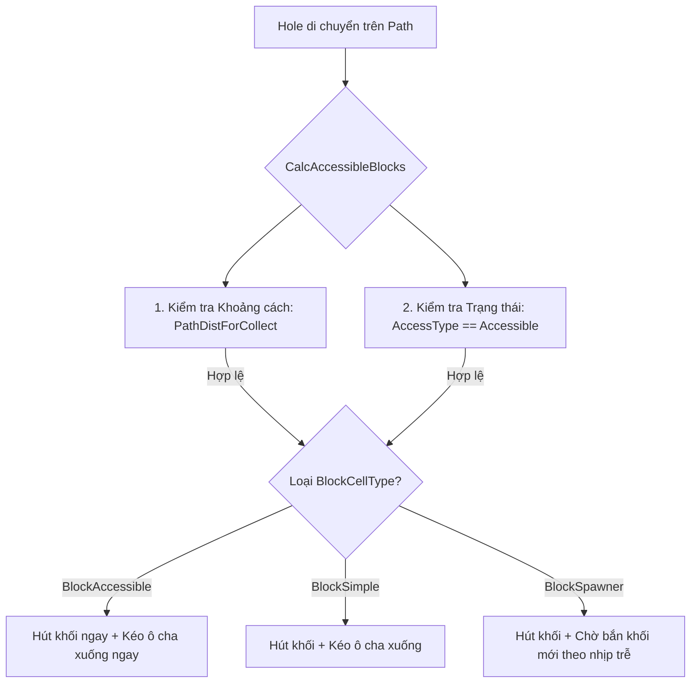

# Quy tắc ưu tiên và Hành vi của từng BlockCellType khi là ô tiếp xúc đầu tiên (First Cell)

Trong cấu trúc bàn chơi của **Into the Hole**, các ô chứa khối (**BlockCell**) liên kết với nhau theo cấu trúc dạng chuỗi cây (cha - con) hướng về phía đường chạy của **Hole**. 

Ô tiếp xúc đầu tiên (First Cell) là ô nằm trực tiếp trên đường di chuyển của Hole, có chỉ số `PathDistForCollect` hợp lệ để Hole có thể hút các khối trên đỉnh của nó. Dưới đây là phân tích chi tiết về **độ ưu tiên** và **hành vi** của từng loại ô (`BlockCellType`) khi đóng vai trò là ô tiếp xúc đầu tiên này.

---

## Bảng so sánh nhanh độ ưu tiên làm ô đầu tiên

| BlockCellType | Độ ưu tiên thiết kế | Khả năng hút trực tiếp | Hành vi khi dọn trống (Clear) | Giới hạn thu thập |
| :--- | :---: | :---: | :--- | :--- |
| **`BlockAccessible`** | ⭐⭐⭐ **Cao nhất** (Chuẩn) | ✅ **Có** | Kéo khối từ ô cha xuống ngay lập tức + Lan truyền trạng thái `Accessible` cho các ô lân cận. | Không giới hạn (phụ thuộc vào nguồn khối trượt xuống). |
| **`BlockSimple`** | ⭐⭐ **Trung bình** (Tùy chọn) | ✅ **Có** | Kéo khối từ ô cha xuống. Không có tính năng lan truyền trạng thái đặc biệt. | Bằng tổng số khối tĩnh được cấu hình sẵn. |
| **`BlockSpawner`** | ⭐ **Thấp nhất** (Tránh dùng) | ⚠️ **Hạn chế** | Kích hoạt bộ đếm thời gian trễ để tự bắn khối mới vào chính nó. | Bị giới hạn bởi chỉ số sức mạnh (`Strength`). |

---

## Chi tiết hành vi theo từng loại ô

### 1. BlockAccessible (Enum = 2) — Ô tiếp cận chuẩn
Đây là thiết kế tiêu chuẩn cho ô đầu tiên nằm sát đường chạy của Hole.

* **Trạng thái truy cập ban đầu**: Luôn được đánh dấu là `BlockCellAccessType.Accessible` ngay từ đầu màn chơi.
* **Cơ chế hoạt động**:
  * Khi Hole tiếp cận, nó sẽ hút khối màu trên đỉnh của ô này.
  * Ngay khi có khoảng trống, ô này kích hoạt `TryPullBlocksFromParent()` để kéo các khối từ các ô `BlockSimple` hoặc `BlockSpawner` phía sau xuống lấp đầy.
  * Đồng thời, nó gửi tín hiệu thông qua `BlockCellManager.RecalculateAccessibility()` để cập nhật trạng thái các ô liên kết phía sau từ `ConnectedToAccessible` thành `Accessible` cho các đợt thu thập tiếp theo.

### 2. BlockSimple (Enum = 1) — Ô chứa tĩnh
Mặc dù thường làm ô trung gian, `BlockSimple` vẫn có thể được cấu hình làm ô đầu tiên trên đường chạy.

* **Cơ chế hoạt động**:
  * Hole vẫn có thể tương tác hút khối trực tiếp nếu ô này có tọa độ tương tác path hợp lệ.
  * Khi bị hút trống, ô này vẫn gọi `TryPullBlocksFromParent()` để kéo khối từ ô cha xuống giống như ô Accessible.
  * **Hạn chế**: Ô này không tự động gửi tín hiệu lan truyền trạng thái `Accessible` mạnh mẽ cho các nhánh lân cận khác như ô Accessible chuyên dụng, dễ gây nghẽn mạch nếu cấu trúc sơ đồ phức tạp.

### 3. BlockSpawner (Enum = 0) — Ô sinh khối tự động
Trong thiết kế màn chơi thực tế, **tránh** đặt Spawner làm ô tiếp xúc trực tiếp đầu tiên vì cơ chế sinh khối của nó cần thời gian.

* **Cơ chế hoạt động nếu là ô đầu tiên**:
  * Ban đầu, nếu Spawner có khối sẵn trên đỉnh, Hole vẫn hút bình thường.
  * Khi ô trống, thay vì kéo khối từ ô cha (nó không có ô cha), Spawner sẽ kích hoạt hàm `TrySpawnBlocks()` để sinh khối mới.
  * **Trễ nhịp độ (Timing lag)**: Khối mới được tạo ra cần thực hiện hoạt ảnh nhảy (`JumpToNewPos`) với một thời gian trễ (`SpawnWaitTimeAfterFill`). Điều này làm giảm tốc độ thu thập của Hole vì Hole phải đứng chờ khối bay tới.
  * **Giới hạn số lượng**: Hoạt động sinh khối bị giới hạn bởi `Strength` hiển thị trên Spawner. Khi `Strength` bằng 0, ô này sẽ hoàn toàn bị dọn sạch và không thể tạo thêm khối nữa.

---

## Cơ chế xử lý giải thuật trước va chạm

Trước khi Hole thực hiện hoạt ảnh hút khối, hệ thống thực hiện hai bước kiểm tra độ ưu tiên như sau:

1. **Ưu tiên về khoảng cách**: Hệ thống lọc ra tất cả các ô có `PathDistForCollect` khớp với vị trí hiện tại của Hole.
2. **Ưu tiên về trạng thái truy cập**: Hệ thống chỉ cho phép Hole thu thập từ các ô có trạng thái `Accessible`. Do đó, `BlockAccessible` luôn được ưu tiên xử lý đầu tiên, dọn đường cho dòng chảy khối từ các ô phía sau trượt xuống.
