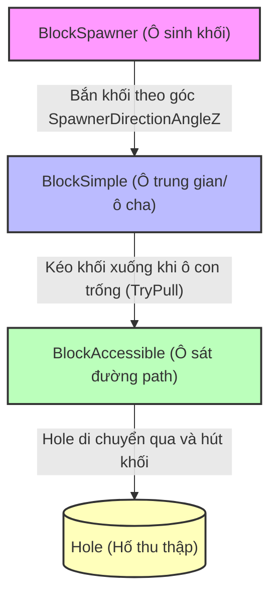

# Quy tắc hoạt động của các BlockCellType

Trong game **Into the Hole**, các ô lưới chứa khối màu trên bàn chơi (**Block Cells**) được chia thành 3 loại cốt lõi thông qua enum `BlockCellType`. Mỗi loại có một vai trò và quy tắc vận hành riêng để tạo nên chiều sâu giải đố cho trò chơi.

---

## 1. BlockSimple (Ô khối thông thường)

`BlockSimple` (giá trị enum = 1) là loại ô chứa khối cơ bản và phổ biến nhất trên bàn chơi.

* **Quy tắc xếp chồng (Stacking)**: 
  * Chứa một chồng các khối màu tĩnh (`CurBlocks`) được sắp đặt trước từ file dữ liệu màn chơi (`LevelData`).
  * Chỉ khối màu nằm ở trên cùng của chồng (`TopBlock`) mới có trạng thái "Top" (`SetAsTop()`) và hiển thị rõ ràng để có thể thu thập.
  * Khi khối đỉnh bị hút mất, khối bên dưới sẽ được kích hoạt để trở thành khối đỉnh mới (`UpdateTopBlock()`). Điều này có thể làm thay đổi màu sắc yêu cầu thu thập của ô đó.
* **Quy tắc di chuyển dòng chảy (Gravity/Pull Flow)**:
  * Ô `BlockSimple` thường được liên kết trong một chuỗi phân cấp cha - con (`ParentBlockCells` và `ChildBlockCells`).
  * Khi ô con phía trước bị trống, ô simple sẽ kích hoạt cơ chế kéo khối từ ô cha (`TryPullBlocksFromParent()`) để lấp đầy khoảng trống, tạo ra hiệu ứng dòng chảy các khối trượt dần về phía đường đi của Hole.

---

## 2. BlockSpawner (Ô sinh khối màu)

`BlockSpawner` (giá trị enum = 0) là ô nguồn đặc biệt, có nhiệm vụ sinh thêm các khối màu mới vào bàn chơi trong quá trình chơi.

* **Cơ chế hoạt động**:
  * Ô này không chỉ chứa các khối cố định mà hoạt động như một "máy bắn khối". 
  * Nó thường đi kèm với một vật cản hiển thị sức mạnh (`ObstacleBlockSpawner`) hiển thị một con số cụ thể (Strength). Con số này thể hiện số lượng khối tối đa mà Spawner có thể sản sinh.
  * Có một cấu trúc hiển thị trực quan (`SpawnerIndicator` và `SpawnerIndicatorRenderer`) báo hiệu màu sắc khối sắp sinh ra.
* **Quy tắc bắn khối**:
  * Khi ô đích (ô con `ChildBlockCells`) được dọn sạch và có khoảng trống, Spawner sẽ kích hoạt hành động sinh khối (`TrySpawnBlocks`).
  * Khối mới sẽ được sinh ra và thực hiện hoạt ảnh nhảy (`JumpToNewPos`) theo hướng bắn xác định bởi góc xoay `SpawnerDirectionAngleZ`.
  * Mỗi lần bắn khối, Spawner sẽ phát hiệu ứng bắn (`SpawnBlockSpawnerShootEfx`), cập nhật giảm số lượng Strength còn lại và cập nhật văn bản hiển thị (`UpdateSpawnerStrength()`).

---

## 3. BlockAccessible (Ô tiếp cận trực tiếp)

`BlockAccessible` (giá trị enum = 2) là ô khối nằm ở vị trí chiến lược, cho phép Hole tương tác trực tiếp khi di chuyển dọc theo đường đi (path).

* **Quy tắc tiếp cận (Accessibility)**:
  * Trong cơ chế game, Hole trượt dọc theo đường path chỉ có thể tương tác hút khối từ các ô nằm sát đường path có chỉ số khoảng cách `PathDistForCollect` hợp lệ. Ô `BlockAccessible` chính là các điểm đón khối này.
  * Ô này đóng vai trò là "điểm cuối" (Sinks) của dòng chảy khối màu trên bàn chơi. Các ô `BlockSimple` và `BlockSpawner` từ phía trong sẽ đẩy hoặc kéo khối dồn về các ô `BlockAccessible` này.
* **Quy tắc giải tỏa**:
  * Để dọn sạch bàn chơi, người chơi bắt buộc phải giải phóng các ô `BlockAccessible` liên tục. 
  * Nếu các ô này bị tắc nghẽn (không có Hole tương ứng hút khối), các khối từ các ô Simple hoặc Spawner phía sau sẽ không thể trượt xuống, dẫn đến việc bàn chơi bị "đóng băng" và người chơi dễ rơi vào trạng thái kẹt khay chứa (Deadlock) dẫn đến thua cuộc.

---

## Tóm tắt Luồng Tương tác giữa các BlockCellType

