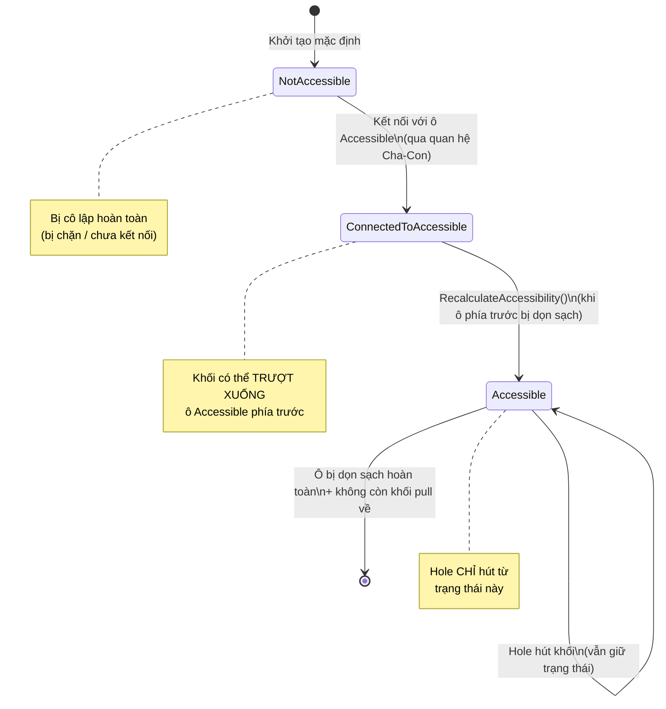

# Ví dụ minh họa: BlockCellAccessType hoạt động như thế nào?

## Bối cảnh bàn chơi

Hãy tưởng tượng một bàn chơi đơn giản gồm **5 ô khối** xếp thành một chuỗi dọc, với **Hole** (hố thu thập) di chuyển trên đường path ở phía dưới cùng.

```
        ┌─────────────┐
        │  Ô 5        │  ← BlockSpawner (máy bắn khối)
        │  🔴🔴🔴     │     Strength = 3
        └──────┬──────┘
               │ (cha → con)
        ┌──────▼──────┐
        │  Ô 4        │  ← BlockSimple (ô trung gian)
        │  🔵🔵       │
        └──────┬──────┘
               │ (cha → con)
        ┌──────▼──────┐
        │  Ô 3        │  ← BlockSimple (ô trung gian)
        │  🔴🔴       │
        └──────┬──────┘
               │ (cha → con)
        ┌──────▼──────┐
        │  Ô 2        │  ← BlockSimple (ô trung gian)
        │  🔵          │
        └──────┬──────┘
               │ (cha → con)
        ┌──────▼──────┐
        │  Ô 1        │  ← BlockAccessible (ô sát đường path)
        │  🔴🔴       │
        └─────────────┘
               │
    ═══════════▼══════════════  ← Đường path
         🕳️ Hole (🔴)
         Capacity = 4
```

---

## Trạng thái AccessType ban đầu

Khi màn chơi bắt đầu, hệ thống tự động gán `BlockCellAccessType` cho từng ô:

| Ô | BlockCellType | AccessType | Lý do |
|:---:|---|---|---|
| Ô 1 | `BlockAccessible` | 🟢 **Accessible** | Nằm sát đường path → Hole có thể hút trực tiếp |
| Ô 2 | `BlockSimple` | 🟡 **ConnectedToAccessible** | Là ô cha của Ô 1 (đã Accessible) → kết nối gián tiếp |
| Ô 3 | `BlockSimple` | 🟡 **ConnectedToAccessible** | Là ô cha của Ô 2 → kết nối gián tiếp |
| Ô 4 | `BlockSimple` | 🟡 **ConnectedToAccessible** | Là ô cha của Ô 3 → kết nối gián tiếp |
| Ô 5 | `BlockSpawner` | 🔴 **NotAccessible** | Spawner — không nằm trong chuỗi truy cập trực tiếp |

> [!IMPORTANT]
> Quy tắc then chốt: **Hole chỉ hút khối từ ô có AccessType = `Accessible`**. Các ô `ConnectedToAccessible` và `NotAccessible` bị Hole bỏ qua hoàn toàn.

---

## Ví dụ từng bước: Hole 🔴 di chuyển qua bàn chơi

### 🔄 Bước 1 — Hole đến gần Ô 1

```
Hole kiểm tra 5 điều kiện:
  ✅ Khoảng cách path: Ô 1 nằm trong tầm
  ✅ Cùng màu: TopBlock của Ô 1 = 🔴, Hole = 🔴
  ✅ Capacity: 4 > 0
  ✅ AccessType: Ô 1 = Accessible ← ĐÂY LÀ ĐIỀU KIỆN QUAN TRỌNG
  ✅ Không bị chướng ngại vật
  → KẾT QUẢ: Hole HÚT 2 khối 🔴 từ Ô 1
```

**Sau bước 1:**
```
        ┌─────────────┐
        │  Ô 5  🔴🔴🔴│  AccessType: 🔴 NotAccessible
        └──────┬──────┘
        ┌──────▼──────┐
        │  Ô 4  🔵🔵  │  AccessType: 🟡 ConnectedToAccessible
        └──────┬──────┘
        ┌──────▼──────┐
        │  Ô 3  🔴🔴  │  AccessType: 🟡 ConnectedToAccessible
        └──────┬──────┘
        ┌──────▼──────┐
        │  Ô 2  🔵    │  AccessType: 🟡 ConnectedToAccessible
        └──────┬──────┘
        ┌──────▼──────┐
        │  Ô 1  (trống)│  AccessType: 🟢 Accessible → nhưng TRỐNG rồi!
        └─────────────┘
    ═══════════════════════
         🕳️ Hole (🔴)
         Capacity = 2 (còn lại)
```

---

### 🔄 Bước 2 — Ô 1 trống → Kích hoạt kéo khối + Lan truyền AccessType

Khi Ô 1 (loại `BlockAccessible`) bị dọn sạch, **2 sự kiện xảy ra đồng thời**:

#### Sự kiện A: `TryPullBlocksFromParent()`
Ô 1 kéo khối từ Ô 2 (ô cha) xuống lấp đầy:

```
  Ô 2: 🔵 ──trượt xuống──→ Ô 1: 🔵
```

#### Sự kiện B: `RecalculateAccessibility()` — **ĐÂY LÀ TÁC DỤNG CHÍNH CỦA AccessType**
Hệ thống chạy thuật toán DFS và **nâng cấp** trạng thái các ô:

```
TRƯỚC khi recalculate:
  Ô 1: 🟢 Accessible (có khối 🔵 mới trượt xuống)
  Ô 2: 🟡 ConnectedToAccessible (đã trống)
  Ô 3: 🟡 ConnectedToAccessible
  Ô 4: 🟡 ConnectedToAccessible

SAU khi recalculate:
  Ô 1: 🟢 Accessible (vẫn giữ nguyên — vẫn sát path)
  Ô 2: 🟢 Accessible  ← NÂNG CẤP! (vì Ô 1 đã dọn, Ô 2 kết nối trực tiếp)
  Ô 3: 🟡 ConnectedToAccessible (chưa đến lượt)
  Ô 4: 🟡 ConnectedToAccessible (chưa đến lượt)
```

> [!TIP]
> Hình dung như **mở cửa dây chuyền**: Khi cánh cửa đầu tiên (Ô 1) mở ra, cánh cửa kế tiếp (Ô 2) cũng được phép mở. Nhưng các cánh cửa xa hơn vẫn phải đợi.

**Sau bước 2:**
```
        ┌─────────────┐
        │  Ô 5  🔴🔴🔴│  🔴 NotAccessible
        └──────┬──────┘
        ┌──────▼──────┐
        │  Ô 4  🔵🔵  │  🟡 ConnectedToAccessible
        └──────┬──────┘
        ┌──────▼──────┐
        │  Ô 3  🔴🔴  │  🟡 ConnectedToAccessible
        └──────┬──────┘
        ┌──────▼──────┐
        │  Ô 2 (trống) │  🟢 Accessible ← MỚI NÂNG CẤP!
        └──────┬──────┘
        ┌──────▼──────┐
        │  Ô 1  🔵    │  🟢 Accessible
        └─────────────┘
    ═══════════════════════
         🕳️ Hole (🔴)
         Capacity = 2
```

---

### 🔄 Bước 3 — Hole kiểm tra Ô 1 lần nữa

```
Hole kiểm tra Ô 1:
  ✅ Khoảng cách: trong tầm
  ❌ Cùng màu: TopBlock = 🔵, Hole = 🔴 → KHÔNG KHỚP!
  → KẾT QUẢ: Hole BỎ QUA Ô 1
```

```
Hole kiểm tra Ô 2:
  ✅ AccessType = Accessible ← nhờ đã được nâng cấp ở Bước 2!
  ... nhưng Ô 2 đang trống → không có khối để hút
  → KẾT QUẢ: Hole BỎ QUA
```

> [!NOTE]
> Hole tiếp tục di chuyển trên path. Lúc này Ô 1 bị "tắc" vì khối 🔵 không khớp màu với Hole 🔴. Đây chính là tính giải đố: người chơi cần tính toán thứ tự Hole nào đi trước.

---

### 🔄 Bước 3b — Sự kiện phụ: Ô 2 trống → Pull tiếp từ Ô 3

Đồng thời, chuỗi pull tiếp tục hoạt động ở background:

```
  Ô 3: 🔴 ──trượt xuống──→ Ô 2: 🔴 (top block)
  
  Sau khi trượt xong, Ô 2 có khối 🔴 nhưng Hole 🔴 đã đi qua rồi.
  → Khối này chờ Hole 🔴 tiếp theo (nếu có).
```

---

## Ví dụ đối lập: Nếu KHÔNG có AccessType thì sao?

Giả sử hệ thống **không có** `BlockCellAccessType`, và Hole được phép hút từ BẤT KỲ ô nào:

```
❌ TÌNH HUỐNG LỖI:

  Hole đi ngang qua và phát hiện Ô 3 (🔴🔴) cũng cùng màu
  → Hole hút thẳng từ Ô 3, bỏ qua Ô 1 và Ô 2
  → Dòng chảy khối bị PHẢI RẼ NHÁI:
     Ô 5 bắn khối → Ô 4 → Ô 3 (BỊ HÚT) ← đường cụt!
     Ô 2, Ô 1 vẫn đầy → BẾ TẮC!
  
  → Game bị phá vỡ logic, người chơi không cần suy nghĩ
  → Mất hoàn toàn tính giải đố
```

> [!CAUTION]
> Không có `BlockCellAccessType`, Hole sẽ hút bừa bãi từ mọi ô cùng màu, phá vỡ cấu trúc cây phân cấp và làm mất tính chiến thuật của game.

---

## Sơ đồ tổng hợp: Vòng đời AccessType



---

## Tóm tắt tác dụng bằng phép ẩn dụ

| Phép ẩn dụ | AccessType | Giải thích |
|---|---|---|
| 🚪 **Cửa đang mở** | `Accessible` | Hole đi ngang qua → lấy hàng được ngay |
| 🔗 **Cửa khóa nhưng có chìa ở cửa trước** | `ConnectedToAccessible` | Phải mở cửa trước (dọn ô Accessible) thì cửa này mới tự động mở |
| 🧱 **Tường bịt kín** | `NotAccessible` | Không thể tiếp cận bằng bất kỳ cách nào (bị chặn bởi vật cản) |

---

## Ví dụ nhánh rẽ: Bàn chơi có 2 nhánh

```
              ┌────────┐
              │  Ô S   │ ← Spawner (🔴, Strength=5)
              └───┬────┘
           ┌──────┴──────┐
     ┌─────▼─────┐ ┌─────▼─────┐
     │ Ô A1 🔴🔴 │ │ Ô B1 🔵🔵 │  ← 2 nhánh Simple
     └─────┬─────┘ └─────┬─────┘
     ┌─────▼─────┐ ┌─────▼─────┐
     │ Ô A2 🔴   │ │ Ô B2 🔵   │  ← 2 ô Accessible sát path
     │ Accessible│ │ Accessible│
     └───────────┘ └───────────┘
  ═══════════════════════════════ ← Path
       🕳️ Hole 🔴        🕳️ Hole 🔵
```

**Trạng thái AccessType ban đầu:**
- Ô A2: 🟢 `Accessible` → Hole 🔴 hút được
- Ô B2: 🟢 `Accessible` → Hole 🔵 hút được
- Ô A1: 🟡 `ConnectedToAccessible` → chờ Ô A2 dọn
- Ô B1: 🟡 `ConnectedToAccessible` → chờ Ô B2 dọn
- Ô S: 🔴 `NotAccessible` → Spawner nằm ngoài chuỗi

**Kịch bản diễn ra:**
1. Hole 🔴 hút 🔴 từ Ô A2 → Ô A2 trống → Pull từ Ô A1 → `RecalculateAccessibility()` → Ô A1 nâng lên `Accessible`
2. Hole 🔵 hút 🔵 từ Ô B2 → Ô B2 trống → Pull từ Ô B1 → `RecalculateAccessibility()` → Ô B1 nâng lên `Accessible`
3. Khi **cả Ô A1 lẫn Ô B1 đều trống**, Spawner mới kích hoạt `TrySpawnBlocks()` bắn khối mới xuống

> [!NOTE]
> `BlockCellAccessType` giúp **mỗi nhánh hoạt động độc lập** — Hole 🔴 chỉ ảnh hưởng nhánh A, Hole 🔵 chỉ ảnh hưởng nhánh B. Hai nhánh không can thiệp lẫn nhau cho đến khi cùng gặp Spawner ở gốc.
