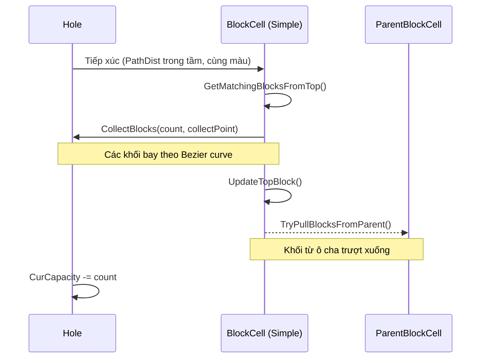
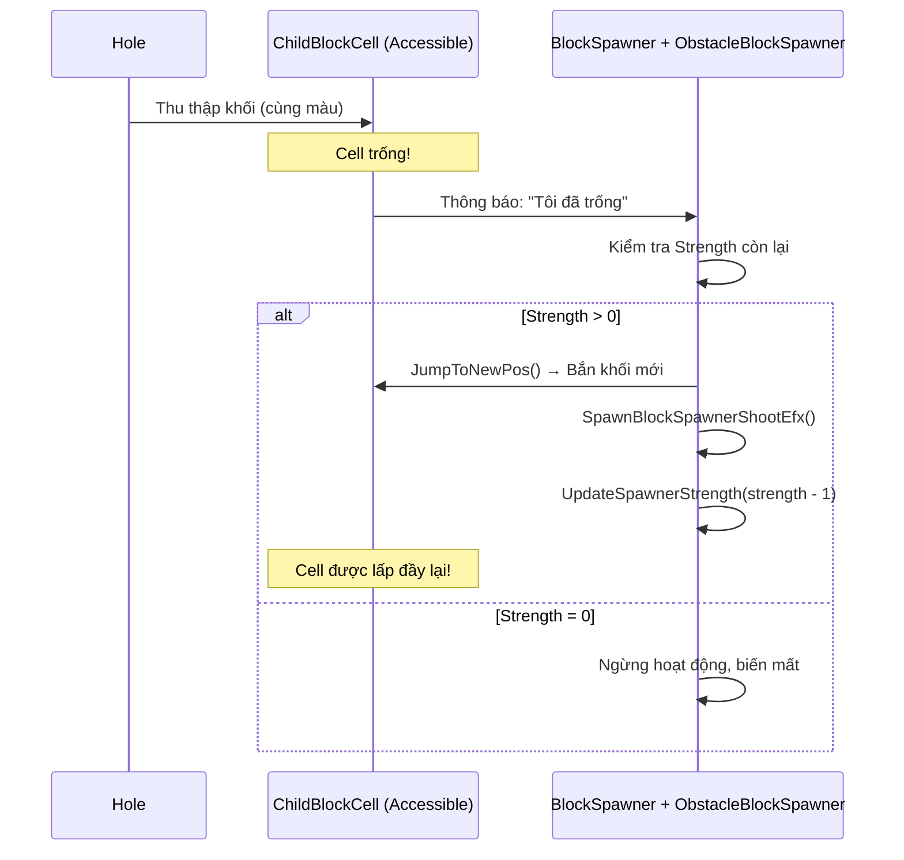
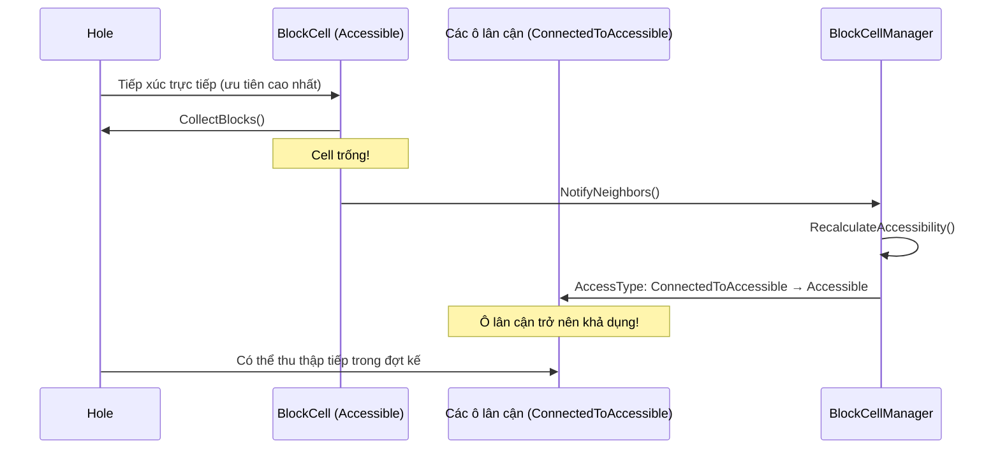
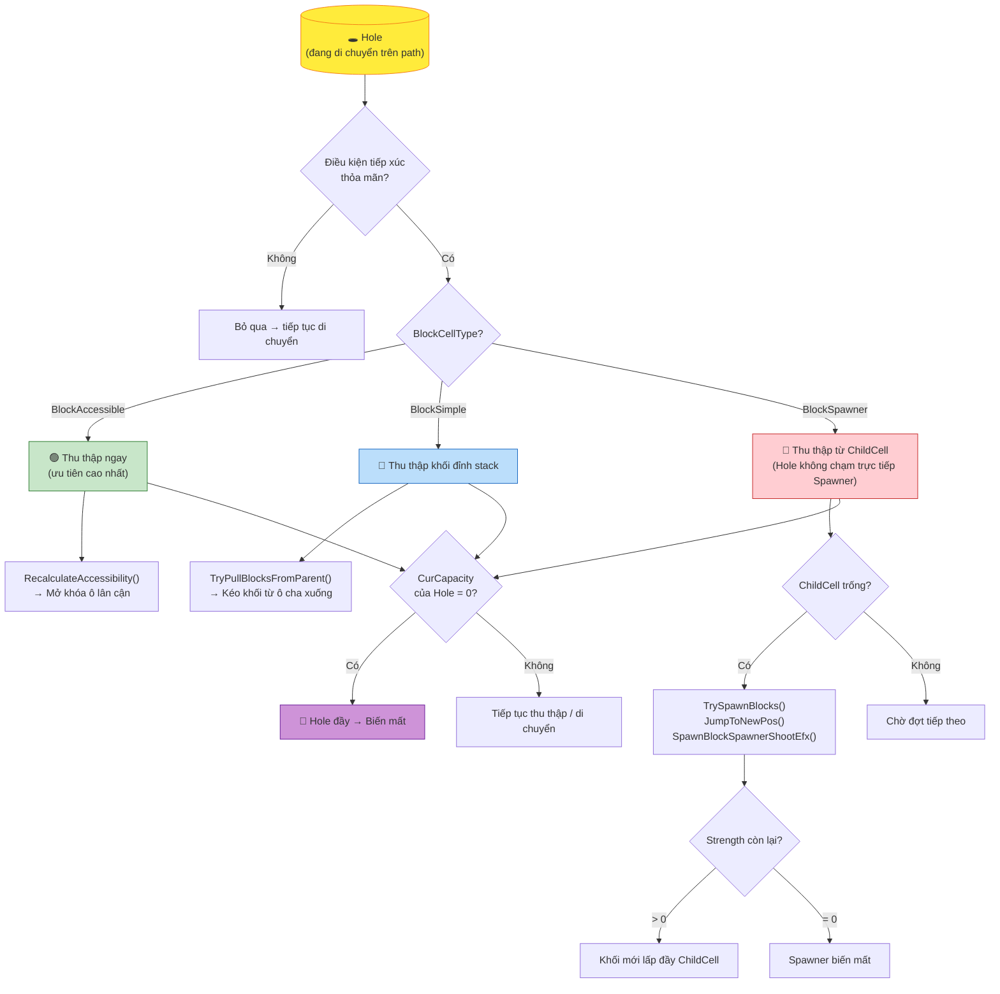

# Hole tiếp xúc với BlockCell: Hành vi theo từng BlockCellType

> Tài liệu mô tả chi tiết toàn bộ sự kiện xảy ra khi một **Hole** (hố thu thập) di chuyển đến điểm có thể tiếp xúc với một **BlockCell** (ô chứa khối), phân tích theo từng loại `BlockCellType`.

---

## Điều kiện tiếp xúc chung (Common Contact Conditions)

Trước khi xét từng loại ô, Hole phải đáp ứng **tất cả** các điều kiện sau để thực sự thu thập khối:

| Điều kiện | Mô tả |
|---|---|
| ✅ Khoảng cách path | `PathDistForCollect` của BlockCell nằm trong tầm `CurPathDist` của Hole |
| ✅ Cùng màu sắc | `TopHoleType` của BlockCell == `CurHoleType` của Hole |
| ✅ Còn sức chứa | `CurCapacity > 0` |
| ✅ Cell khả dụng | `BlockCellAccessType` của cell là `Accessible` hoặc `ConnectedToAccessible` |
| ✅ Không bị chướng ngại vật | Không có `ObstacleBlock` đang khóa cell |

Nếu **bất kỳ** điều kiện nào thất bại → Hole bỏ qua ô đó và tiếp tục di chuyển.

---

## BlockCellType 1: `BlockSimple` (Enum = 1)

> Ô khối thông thường, chứa chồng khối màu tĩnh cố định.

### Khi Hole tiếp xúc:

```
Hole trượt đến vị trí của BlockSimple
│
├─ BƯỚC 1: Kiểm tra điều kiện (xem bảng trên)
│  └─ Nếu không pass → Bỏ qua
│
├─ BƯỚC 2: BlockCellManager.CalcAccessibleBlocks() quét cell
│  └─ Đếm số khối liên tiếp cùng màu từ đỉnh stack (GetMatchingBlocksFromTop)
│
├─ BƯỚC 3: Thu thập khối
│  ├─ Số khối lấy = MIN(khối cùng màu liên tiếp, CurCapacity còn lại)
│  ├─ BlockCell.CollectBlocks() được gọi
│  └─ Từng khối bay theo đường Bezier curve đến Hole (stagger delay giữa các khối)
│
├─ BƯỚC 4: Cập nhật BlockCell
│  ├─ Xóa các khối đã thu thập khỏi CurBlocks
│  ├─ UpdateTopBlock() → khối tiếp theo (có thể màu KHÁC) lộ ra
│  ├─ CurVisibleBlockCt giảm
│  └─ Nếu còn ParentBlockCells → TryPullBlocksFromParent()
│     └─ Khối từ ô cha TRƯỢT XUỐNG lấp đầy vị trí vừa trống
│
├─ BƯỚC 5: Hiệu ứng khi khối đến Hole
│  ├─ Phát particle effect (VFX)
│  ├─ Phát sound effect
│  ├─ Hole co giãn bounce/squish (HoleBlockCollectionEfx)
│  └─ Cập nhật fill indicator
│
└─ BƯỚC 6: Trừ CurCapacity của Hole
   ├─ CurCapacity > 0 → Tiếp tục di chuyển / thu thập
   └─ CurCapacity = 0 → Hole đầy → Bắt đầu chuỗi biến mất
```

### Sơ đồ luồng:



---

## BlockCellType 2: `BlockSpawner` (Enum = 0)

> Ô sinh khối, hoạt động như máy bắn khối màu vào bàn chơi.

### Khi Hole tiếp xúc:

```
Hole trượt đến vị trí của BlockSpawner
│
├─ BƯỚC 1: Kiểm tra điều kiện (xem bảng trên)
│  └─ Lưu ý: BlockSpawner thường KHÔNG nằm trực tiếp trên path
│     Hole chỉ thu thập từ ô ĐÍCH (ChildBlockCell) mà Spawner bắn khối vào
│
├─ BƯỚC 2: Hole thu thập từ ô đích (ChildBlockCell)
│  ├─ Giống quy trình BlockSimple ở trên
│  └─ Các khối trong ChildBlockCell bay vào Hole
│
├─ BƯỚC 3: ChildBlockCell bị trống → Kích hoạt Spawner!
│  ├─ BlockCell.TrySpawnBlocks() được gọi
│  ├─ ObstacleBlockSpawner kiểm tra Strength còn lại
│  │  ├─ Strength > 0 → Tiếp tục sinh khối
│  │  └─ Strength = 0 → Spawner ngừng hoạt động, xóa khỏi bàn chơi
│  │
│  ├─ Spawner tạo khối mới với màu đã được định sẵn (BlockCol)
│  ├─ Khối mới thực hiện JumpToNewPos() theo hướng SpawnerDirectionAngleZ
│  ├─ Phát hiệu ứng bắn: SpawnBlockSpawnerShootEfx()
│  └─ UpdateSpawnerStrength(newStrength) → cập nhật số hiển thị trên UI
│
└─ BƯỚC 4: Khối mới đến ChildBlockCell
   ├─ ChildBlockCell được lấp đầy trở lại
   └─ Hole (nếu đang ở Spot gần đó) sẽ tiếp tục hút trong đợt kế tiếp
```

### Sơ đồ luồng:



---

## BlockCellType 3: `BlockAccessible` (Enum = 2)

> Ô tiếp cận trực tiếp, nằm sát đường path của Hole và là điểm thu thập chính.

### Khi Hole tiếp xúc:

```
Hole trượt đến vị trí của BlockAccessible
│
├─ BƯỚC 1: Kiểm tra điều kiện
│  ├─ BlockAccessible có PathDistForCollect hợp lệ (nằm sát path)
│  ├─ BlockCellAccessType = Accessible (0) → Pass ngay!
│  └─ Không cần chờ ô cha dọn trước
│
├─ BƯỚC 2: Thu thập khối
│  ├─ Giống quy trình BlockSimple
│  └─ Đây là ưu tiên cao nhất vì nằm ngay trên đường đi của Hole
│
├─ BƯỚC 3: Cập nhật AccessType lan truyền
│  ├─ Cell này trống → NotifyNeighbors()
│  ├─ BlockCellManager.RecalculateAccessibility()
│  └─ Các ô đằng sau (ConnectedToAccessible) có thể được NÂNG CẤP
│     lên trạng thái Accessible → Hole có thể thu thập chúng tiếp!
│
└─ BƯỚC 4: Tạo dòng chảy ngược về phía sau
   ├─ Các ô BlockSimple/BlockSpawner phía sau dồn khối về
   └─ Vòng lặp tiếp diễn cho đến khi hết khối hoặc Hole đầy
```

### Sơ đồ luồng:



---

## So sánh hành vi tổng hợp

| Hành vi khi Hole tiếp xúc | `BlockSimple` | `BlockSpawner` | `BlockAccessible` |
|---|:---:|:---:|:---:|
| Có thể thu thập trực tiếp từ path | ❌ (thường gián tiếp) | ❌ (bắn qua ChildCell) | ✅ Ưu tiên cao nhất |
| Kéo khối từ ô cha (Pull from Parent) | ✅ Có | ❌ Không | ✅ Có |
| Sinh thêm khối mới (Spawn New Blocks) | ❌ Không | ✅ Có | ❌ Không |
| Lan truyền trạng thái Accessible | ✅ Một phần | ❌ Không | ✅ Lan truyền mạnh |
| Hiệu ứng đặc biệt khi trống | Kéo ô cha | Kích hoạt Spawner bắn | Mở khóa ô lân cận |
| Số khối được định nghĩa sẵn | ✅ Cố định | ❌ Động (theo Strength) | ✅ Cố định |

---

## Sơ đồ tổng hợp: Hole gặp các loại BlockCell



---

## Các file script liên quan

| Script | Vai trò |
|---|---|
| [BlockCell.cs](Assets/Scripts/Assembly-CSharp/BlockCell.cs) | Logic chính của từng loại ô, `TrySpawnBlocks`, `TryPullBlocksFromParent` |
| [BlockCellType.cs](Assets/Scripts/Assembly-CSharp/BlockCellType.cs) | Enum định nghĩa 3 loại ô |
| [BlockCellManager.cs](Assets/Scripts/Assembly-CSharp/BlockCellManager.cs) | Quản lý tất cả cell, tính toán accessibility (DFS), cung cấp cell cho Hole |
| [BlockCellAccessType.cs](Assets/Scripts/Assembly-CSharp/BlockCellAccessType.cs) | Enum: Accessible, ConnectedToAccessible, NotAccessible |
| [ObstacleBlockSpawner.cs](Assets/Scripts/Assembly-CSharp/ObstacleBlockSpawner.cs) | Xử lý logic bắn khối và quản lý Strength của BlockSpawner |
| [Block.cs](Assets/Scripts/Assembly-CSharp/Block.cs) | Khối đơn lẻ, `JumpToNewPos`, `SetPathDistForCollect` |
| [Hole.cs](Assets/Scripts/Assembly-CSharp/Hole.cs) | Hố thu thập, `CurCapacity`, `CurHoleType`, `PathDistForCollect` |
| [BlockCellProxy.cs](Assets/Scripts/Assembly-CSharp/BlockCellProxy.cs) | Data proxy trong editor, `SpawnerDirectionAngleZ`, `ChildCellProxies` |
