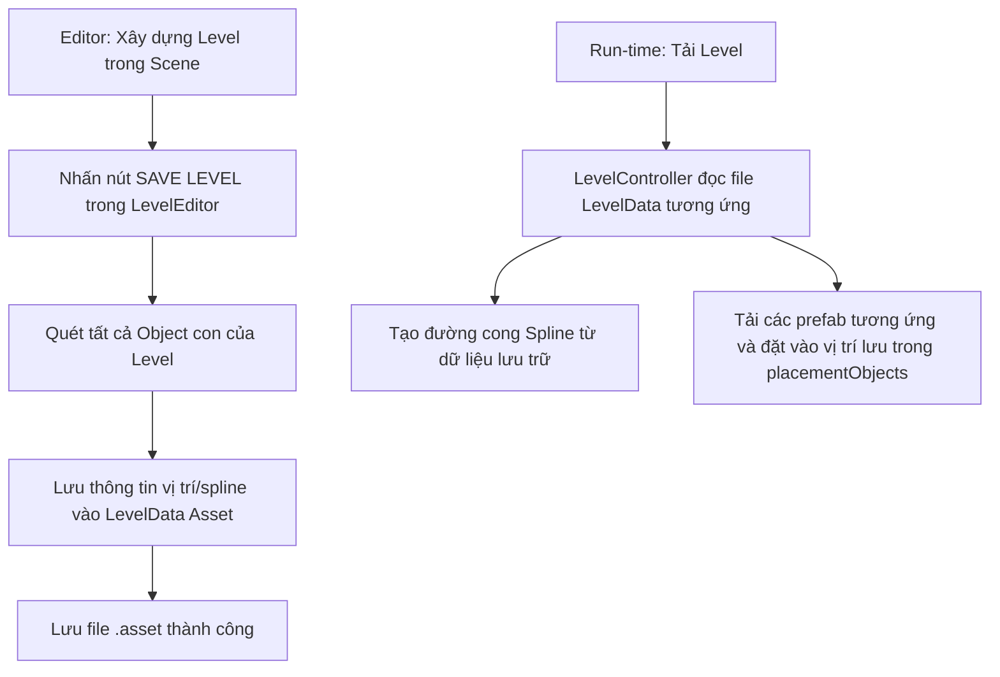

# Đề xuất thiết kế: Lưu trữ dữ liệu Level bằng ScriptableObject

Tài liệu này trình bày giải pháp chuyển đổi cơ chế quản lý Level trong dự án từ dạng **Prefab** sang dạng **ScriptableObject (LevelData)**.

---

## 1. Lý do nên chuyển đổi sang ScriptableObject

*   **Tối ưu dung lượng & Hiệu năng**: Tránh lưu trữ các dữ liệu hình học (mesh, collider) lặp đi lặp lại trong Prefab. Chỉ lưu tọa độ, góc xoay, loại vật thể (data-only).
*   **Tránh xung đột Git (Merge Conflict)**: File `.prefab` của Unity rất khó giải quyết xung đột khi nhiều người cùng sửa Level. File `.asset` (ScriptableObject) có cấu trúc dữ liệu thuần văn bản, dễ merge hơn nhiều.
*   **Quản lý & Tải Level linh hoạt**: Dễ dàng chỉnh sửa chỉ số Level, độ khó, hoặc cấu hình bổ sung mà không cần mở/sửa từng Prefab.
*   **Tương thích Object Pooling**: Hỗ trợ instantiate các thành phần trong Level (như Pipe, Obstacle, Booster) từ pool thay vì load cứng cả Prefab lớn.

---

## 2. Thiết kế cấu trúc dữ liệu (Class Design)

Chúng ta sẽ tạo các cấu trúc dữ liệu chính sau:

### A. Cấu trúc dữ liệu của từng vật thể trong Level (`ObjectData`)
Mỗi vật thể xuất hiện trong Level (đoạn ống trượt, hố, booster, chướng ngại vật,...) sẽ được tuần tự hóa (serialize) thành thông tin định vị:

```csharp
using System;
using UnityEngine;

[Serializable]
public struct LevelObjectData
{
    public string prefabIdentifier; // ID hoặc tên Prefab trong Resources (ví dụ: "PipePrefab", "BoosterItem")
    public Vector3 position;
    public Quaternion rotation;
    public Vector3 scale;
    
    // Thuộc tính tùy chỉnh bổ sung cho từng loại vật thể (nếu có)
    public string customData; // Chuỗi JSON hoặc mã để lưu thông tin riêng biệt (ví dụ: góc uốn của ống)
}
```

### B. Cấu trúc dữ liệu đường cong Bezier (`SplineData`)
Vì game trượt nước có các đường cong spline đặc thù, chúng ta cần lưu trữ các điểm mốc của spline:

```csharp
[Serializable]
public struct SplinePointData
{
    public Vector3 localPosition;
    public Quaternion localRotation;
    public Vector3 localScale;
    public int handleMode; // Free, Aligned, Mirrored
    public Vector3 precedingControlPointLocalPosition;
    public Vector3 followingControlPointLocalPosition;
    public Vector3 normal;
}

[Serializable]
public struct LevelSplineData
{
    public string splineName; // Tên của spline trong Level
    public bool loop;
    public bool autoCalculateNormals;
    public List<SplinePointData> points;
}
```

### C. Lớp ScriptableObject quản lý Level (`LevelData`)
File `.asset` đại diện cho một Level:

```csharp
using System.Collections.Generic;
using UnityEngine;

[CreateAssetMenu(fileName = "Level_Data", menuName = "Waterpark/Level Data")]
public class LevelData : ScriptableObject
{
    [Header("Level Configurations")]
    public int levelIndex;
    public DifficultLevel difficulty = DifficultLevel.Easy;
    public bool isTutorial;

    [Header("Splines (Máng trượt)")]
    public List<LevelSplineData> splines = new List<LevelSplineData>();

    [Header("Level Objects (Hố, Chướng ngại vật, Item,...)")]
    public List<LevelObjectData> placementObjects = new List<LevelObjectData>();
}
```

---

## 3. Luồng hoạt động (Workflow)



### Khi Lưu Level (Editor Save):
1. Quét qua toàn bộ các Component `BezierSpline` nằm dưới GameObject Level hiện tại và lưu các điểm con vào `splines`.
2. Quét qua các GameObject con khác (không phải spline/point) như: `Hole`, `BoosterItem`, các chướng ngại vật...
3. Lưu tên Prefab gốc (hoặc Tag) của chúng kèm Position, Rotation, Scale vào danh sách `placementObjects`.
4. Ghi đè hoặc tạo mới file `LevelData` Asset.

### Khi Tải Level (Run-time Load):
1. `LevelController` tải file `LevelData` tương ứng với Level hiện tại.
2. Tạo ra các spline rỗng và dựng lại các điểm từ `splines`.
3. Duyệt qua `placementObjects`, sử dụng `Resources.Load` để Instantiate các Prefab tương ứng và đặt đúng vị trí lưu trữ.

---

## 4. Các bước triển khai chi tiết

1. **Bước 1**: Tạo các file C# chứa cấu trúc dữ liệu (`LevelData.cs` và các struct đi kèm).
2. **Bước 2**: Cập nhật [LevelController.cs](file:///d:/Loc/Work/os005-waterpark/Assets/Project/Scripts/Controller/LevelController.cs):
   - Thêm phương thức để sinh Level từ dữ liệu `LevelData`.
   - Thêm phương thức để quét Scene và xuất dữ liệu sang `LevelData`.
3. **Bước 3**: Cập nhật [LevelEditorWindow.cs](file:///d:/Loc/Work/os005-waterpark/Assets/Project/Scripts/Editor/LevelEditorWindow.cs) để giao diện editor tương tác trực tiếp với hệ thống ScriptableObject mới.

---

## 5. Câu hỏi thảo luận & Khảo sát ý kiến của bạn

> [!IMPORTANT]
> Để hoàn thiện bản thiết kế này đúng với ý đồ của bạn nhất, xin vui lòng cho biết:
> 1. Trong một Level hiện tại của bạn, ngoài các máng trượt (**BezierSpline**) và **Hole**, còn có những loại GameObject hay Prefab nào khác cần lưu trữ vị trí không?
> 2. Các vật thể con trong Level hiện tại đang được sắp xếp phân cấp (Hierarchy) như thế nào? (Ví dụ: Tất cả đều là con trực tiếp của GameObject Level chính, hay chia thành các thư mục con như `Pipes`, `Obstacles`, `Items`?)
