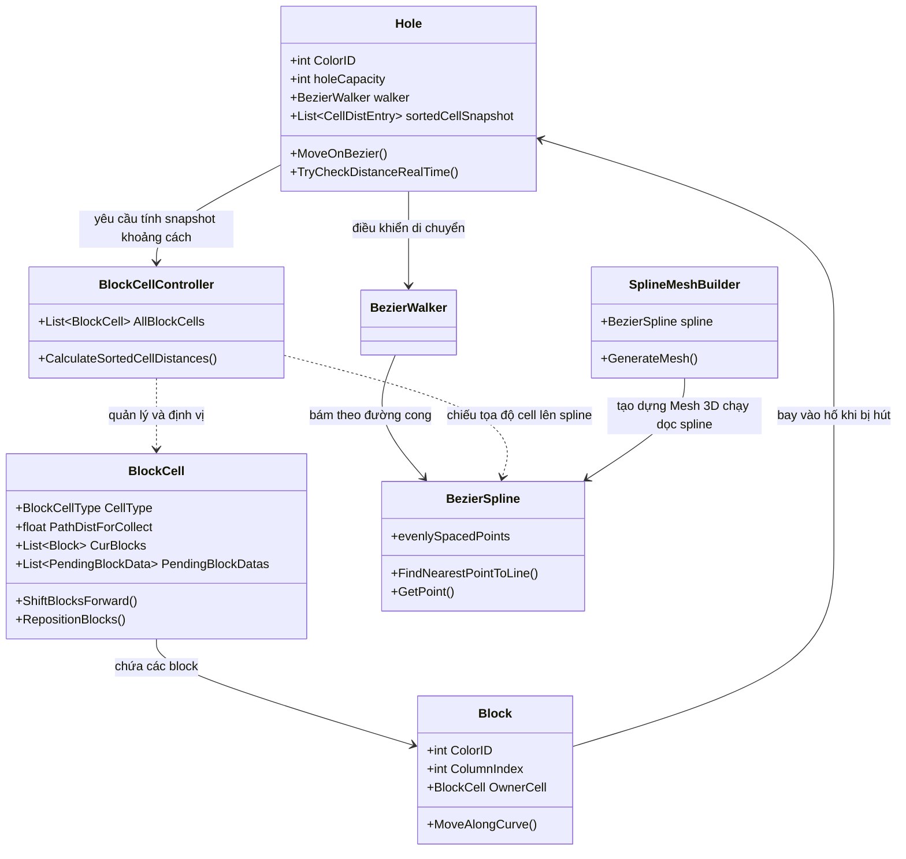
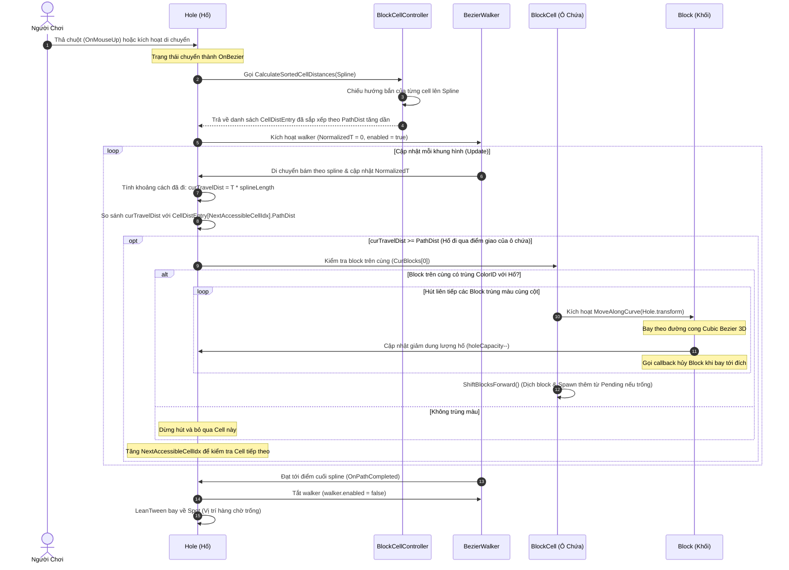

# Hướng Dẫn Luồng Hoạt Động: Hole, BlockCell, Block & Bezier

Tài liệu này tóm tắt chi tiết kiến trúc, mối quan hệ và luồng hoạt động giữa các đối tượng chính trong game: **Hole (Hố)**, **BlockCell (Ô chứa khối)**, **Block (Khối màu)** và **Hệ thống Bezier (Đường cong & Mesh)**.

---

## 1. Sơ Đồ Tổng Quan Mối Quan Hệ (Architecture)



---

## 2. Luồng Hoạt Động Chi Tiết (Workflow Sequence)

Quy trình hoạt động được mô tả theo thứ tự thời gian từ lúc người chơi kích hoạt di chuyển hố đến khi hố hoàn thành hành trình và thu thập các khối block:



---

## 3. Phân Tích Kỹ Thuật Các Thành Phần Liên Quan

### 3.1. Hố Di Chuyển & Hút Khối Màu (`Hole.cs`)
- **Cách tính quãng đường thực tế trên Spline:**
  Quãng đường di chuyển của hố dọc theo đường cong được quy đổi từ `NormalizedT` (tỷ lệ từ `0` đến `1` của `BezierWalker`):
  ```csharp
  _curPathTravelDist = spline.evenlySpacedPoints.GetPercentageAtNormalizedT(walker.NormalizedT) 
                      * spline.evenlySpacedPoints.splineLength;
  ```
- **Real-time Check:** Trong hàm `Update`, nếu hố đang chạy trên đường cong (`HoldState.OnBezier`), nó liên tục so sánh quãng đường đã đi với snapshot khoảng cách của các `BlockCell`.
- **Hút Block trùng màu:** Khi đi ngang qua điểm giao nhau của ô chứa, hố kiểm tra `CurBlocks[0]` (block ở hàng đầu). Nếu khớp `ColorID`, các block cùng màu kế tiếp trong cột sẽ lần lượt chuyển sang trạng thái bay về phía hố, đồng thời dung lượng hố giảm đi (`_holeCapacity--`).

### 3.2. Ô Chứa Khối Màu & Cơ Chế Hàng Đợi (`BlockCell.cs`)
- **Quản lý Block trong hàng:**
  - `CurBlocks`: Danh sách các block vật lý đang hiển thị trên sân.
  - `PendingBlockDatas`: Danh sách chờ chứa thông tin màu và số lượng block xếp hàng đợi phía sau (hoạt động như băng chuyền).
- **Cơ Chế Băng Chuyền (`ShiftBlocksForward`):**
  1. Khi một cột block được thu thập hết, cột đó bị loại khỏi hàng đợi hiển thị (`_activeColOrder`).
  2. Spawn thêm cột block mới từ `PendingBlockDatas` ở vị trí gốc (origin).
  3. Định vị lại và chạy hiệu ứng dịch chuyển toàn bộ block lên phía trước bằng **LeanTween** thông qua hướng bắn `GetSpawnDirection()` của cell.

### 3.3. Thuật Toán Chiếu Điểm Từ Cell Lên Spline (`BlockCellController.cs`)
Để biết lúc nào Hố đi qua vị trí giao của một `BlockCell`, hệ thống cần chiếu vị trí của cell lên đường cong Bezier:
1. Xác định hướng bắn của Cell (`GetSpawnDirection()`) từ góc quay `SpawnerDirectionAngleZ` và chuyển sang hệ tọa độ thế giới (World Space).
2. Tạo một tia (Ray) đi từ vị trí của Cell theo hướng bắn với chiều dài lớn (ví dụ: `100f`).
3. Sử dụng API của thư viện Bezier:
   ```csharp
   spline.FindNearestPointToLine(lineStart, lineEnd, out Vector3 pointOnLine, out float normalizedT);
   ```
4. Quy đổi `normalizedT` thu được thành khoảng cách thực tế `PathDist` trên Spline và lưu vào snapshot để Hole duyệt qua đúng trình tự di chuyển.

### 3.4. Quỹ Đạo Bay Khối Màu (`Block.cs`)
Khi Block bị hút về phía hố, nó không bay thẳng mà bay theo quỹ đạo parabol đẹp mắt bằng **Cubic Bezier (Bezier bậc 3)** thông qua hàm `MoveAlongCurve`:
- **Hai điểm kiểm soát (Control Points):**
  - `controlPoint1`: Điểm bắt đầu nâng lên theo trục Y (`startPoint + Vector3.up * curveHeight`).
  - `controlPoint2`: Điểm kết thúc (Hố) nâng lên theo trục Y (`targetPoint + Vector3.up * curveHeight`).
- **Phương trình Cubic Bezier:**
  $$\mathbf{B}(t) = (1-t)^3\mathbf{P}_0 + 3(1-t)^2t\mathbf{P}_1 + 3(1-t)t^2\mathbf{P}_2 + t^3\mathbf{P}_3$$
  *Trong đó $P_0$ là vị trí xuất phát của Block, $P_1$ và $P_2$ là hai điểm kiểm soát, $P_3$ là vị trí đích đến (Hố).*

### 3.5. Tạo Dải Băng 3D Dọc Theo Bezier (`SplineMeshBuilder.cs`)
Script này dựng một Mesh dạng dải băng 3D uốn lượn theo đường spline để tạo cảm giác hố di chuyển trên một con đường hoặc máng trượt nước:
- **Tạo các đỉnh (Vertices):** Dọc theo spline chia thành `resolution` phân đoạn. Tại mỗi điểm chia, tính hướng đi tiếp tuyến (`tangent`) và hướng vuông góc (`right` hoặc `normal`). Tạo hai đỉnh ở hai bên mép trái/phải với khoảng cách bằng `width * 0.5f`.
- **Trải tọa độ UV:** Tính khoảng cách thực tế giữa các phân đoạn để gán tọa độ UV chính xác, tránh hiện tượng texture bị kéo giãn ở những khúc cua ngặt nghèo.
- **Dựng đa giác (Triangles):** Nối các đỉnh trái/phải của các phân đoạn kề nhau tạo thành các tam giác để dựng nên Mesh hoàn chỉnh.

---

> [!NOTE]
> Hệ thống này sử dụng kết hợp giữa **phép toán hình học spline** để tính toán thời điểm kích hoạt hút khối, **LeanTween** để xử lý các chuyển động dịch chuyển mượt mà của block trên băng chuyền, và **phương trình Bezier bậc 3** tự lập trình để tạo hiệu ứng bay nghệ thuật cho block.
