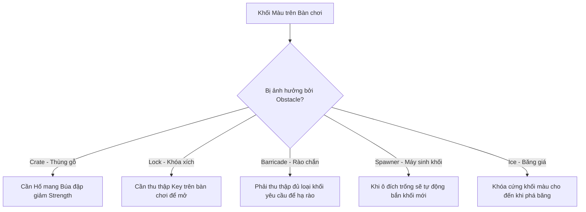
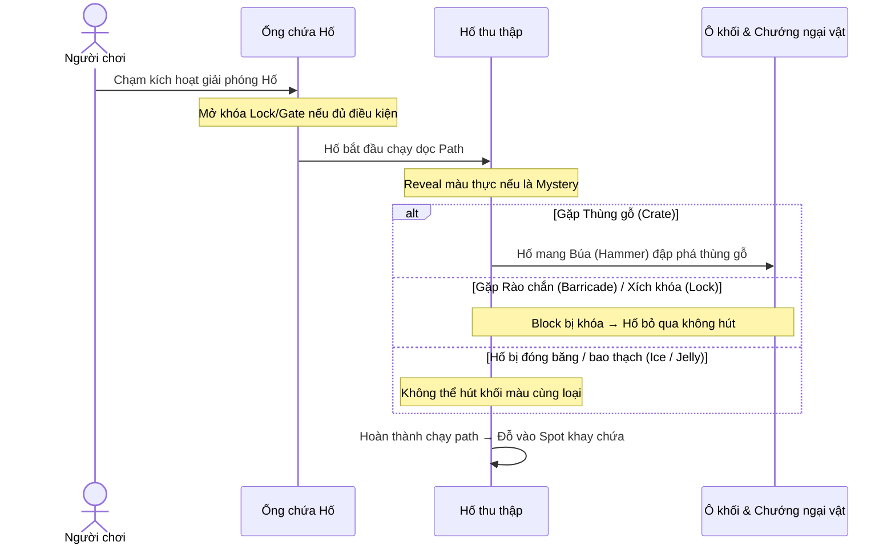

# Các Cơ Chế Chướng Ngại Vật (Obstacles) Trong Into the Hole

Trong **Into the Hole**, các chướng ngại vật (**Obstacles**) đóng vai trò cốt lõi trong việc tăng độ khó, đa dạng hóa chiến thuật và tạo ra các câu đố màu sắc phức tạp. Chúng được chia làm 3 nhóm chính dựa trên thực thể mà chúng tác động:
1. **Chướng ngại vật tại Ống chứa Hố (Pipe Obstacles)**
2. **Chướng ngại vật tại Khối màu (Block Obstacles)**
3. **Chướng ngại vật trực tiếp trên Hố (Hole Obstacles)**

---

## 1. Chướng ngại vật tại Ống chứa Hố (Pipe Obstacles)
*Được định nghĩa trong [PipeObstacleType.cs](file:///d:/Loc/Other/Ducjd/intotheHole/ExportedProject/Assets/Scripts/Assembly-CSharp/PipeObstacleType.cs) và quản lý bởi các lớp như `ObstaclePipe`.*

Các chướng ngại vật này nằm ở hàng chờ cổng ống xuất phát, ảnh hưởng trực tiếp đến khả năng giải phóng và thứ tự xuất phát của các Hố thu thập.

| Loại Chướng Ngại Vật | Tác dụng trong Game | Cách giải quyết / Vượt qua | Lớp xử lý liên quan |
| :--- | :--- | :--- | :--- |
| **Lock (Khóa xích ống)** | Dùng xích sắt khóa đầu ống chứa Hố, không cho phép người chơi chạm giải phóng Hố đứng đầu. | Thu thập các **Chìa khóa (Key)** nằm trên các ô khối của bàn chơi. Chìa khóa sẽ bay về để mở khóa ống. | [ObstaclePipeLock.cs](file:///d:/Loc/Other/Ducjd/intotheHole/ExportedProject/Assets/Scripts/Assembly-CSharp/ObstaclePipeLock.cs) |
| **GatedSpawner (Cửa chặn)** | Cửa chắn vật lý chặn đầu ống. Chỉ mở ra khi hoàn thành một điều kiện nhất định. | Người chơi cần đạt cột mốc yêu cầu của màn chơi (ví dụ: thu thập đủ số lượng khối của một màu nhất định). | [ObstaclePipeGateManager.cs](file:///d:/Loc/Other/Ducjd/intotheHole/ExportedProject/Assets/Scripts/Assembly-CSharp/ObstaclePipeGateManager.cs) |
| **Mystery (Bí ẩn)** | Ẩn hoàn toàn thông tin về **Màu sắc** và **Sức chứa** của các Hố nằm trong ống (hiển thị dưới dạng dấu chấm hỏi `?`). | Khi Hố được giải phóng ra khỏi ống và chạy trên đường path, thông tin thực tế mới được hiển thị rõ. | [ObstaclePipeMystery.cs](file:///d:/Loc/Other/Ducjd/intotheHole/ExportedProject/Assets/Scripts/Assembly-CSharp/ObstaclePipeMystery.cs) |
| **Mud (Bùn ống)** | Bùn bám làm kẹt và giảm đáng kể tốc độ di chuyển của Hố khi chạy ra khỏi ống. | Hố sẽ trượt chậm hơn trên đường path, người chơi cần tính toán thời gian trễ của nhịp thu thập. | [ObstaclePipeMud.cs](file:///d:/Loc/Other/Ducjd/intotheHole/ExportedProject/Assets/Scripts/Assembly-CSharp/ObstaclePipeMud.cs) |
| **Ice (Băng ống)** | Đóng băng đầu ống, giữ chặt Hố bên trong và làm ngừng trệ hoạt động giải phóng. | Phá vỡ lớp băng bằng cách hoàn thành các điều kiện thu thập khối xung quanh hoặc tương tác bổ trợ. | [ObstaclePipeIce.cs](file:///d:/Loc/Other/Ducjd/intotheHole/ExportedProject/Assets/Scripts/Assembly-CSharp/ObstaclePipeIce.cs) |
| **Jumper (Nhảy cóc)** | Thiết bị bổ trợ/cản trở giúp bắn hoặc chuyển hướng Hố sang một đường di chuyển khác. | Hố đi qua sẽ tự động kích hoạt nhảy/chuyển lane. | [ObstaclePipeJumper.cs](file:///d:/Loc/Other/Ducjd/intotheHole/ExportedProject/Assets/Scripts/Assembly-CSharp/ObstaclePipeJumper.cs) |
| **Dummy (Hố giả)** | Hố rác không có khả năng thu thập, đóng vai trò làm tắc nghẽn hàng chờ hoặc khay đỗ. | Người chơi phải tìm cách giải phóng và dọn dẹp chúng để lấy chỗ cho hố thật. | - |

---

## 2. Chướng ngại vật tại Ô Khối Màu (Block Obstacles)
*Được định nghĩa trong [BlockObstacleType.cs](file:///d:/Loc/Other/Ducjd/intotheHole/ExportedProject/Assets/Scripts/Assembly-CSharp/BlockObstacleType.cs) và quản lý bởi `ObstacleBlockManager`.*

Tác động trực tiếp lên bàn chơi, khóa hoặc cản trở việc các khối màu trượt xuống hoặc bay vào Hố.

### Chi tiết các loại chướng ngại vật khối:

* **Crate (Thùng gỗ)**:
  * **Cơ chế**: Bao bọc các khối màu bên trong, ngăn không cho Hố thu thập trực tiếp. Thùng gỗ có chỉ số Độ bền (`Strength`) hiển thị bằng số.
  * **Giải quyết**: Khi một Hố được trang bị **Búa (Hammer)** đi qua, búa sẽ tự động đập để giảm độ bền của thùng gỗ đi 1. Khi độ bền về 0, thùng gỗ vỡ hoàn toàn, giải phóng khối màu bên trong.
  * **Mã nguồn**: [ObstacleBlockCrate.cs](file:///d:/Loc/Other/Ducjd/intotheHole/ExportedProject/Assets/Scripts/Assembly-CSharp/ObstacleBlockCrate.cs)

* **Lock (Khóa xích khối)**:
  * **Cơ chế**: Quấn xích khóa quanh ô khối.
  * **Giải quyết**: Người chơi cần thu thập vật phẩm **Chìa khóa (Key)** nằm trên các ô khác để mở xích.
  * **Mã nguồn**: [ObstacleBlockLock.cs](file:///d:/Loc/Other/Ducjd/intotheHole/ExportedProject/Assets/Scripts/Assembly-CSharp/ObstacleBlockLock.cs)

* **Barricade (Rào chắn)**:
  * **Cơ chế**: Tường chắn vật lý ngăn cản các khối bên trong nhảy ra ngoài. Rào chắn liên kết với một chỉ số thu thập gồm: loại khối cần thu thập (`TargetBlockCollectType`) và số lượng (`CurTargetBlockCt`).
  * **Giải quyết**: Khi người chơi thu thập các khối mục tiêu tương ứng trên bàn chơi, rào chắn sẽ ngắn lại dần và biến mất khi hoàn thành chỉ tiêu.
  * **Mã nguồn**: [ObstacleBlockBarricade.cs](file:///d:/Loc/Other/Ducjd/intotheHole/ExportedProject/Assets/Scripts/Assembly-CSharp/ObstacleBlockBarricade.cs)

* **Spawner (Máy sinh khối)**:
  * **Cơ chế**: Một ụ súng sinh khối. Khi ô đích trước mặt nó trống, Spawner sẽ bắn ra khối màu mới (`JumpToNewPos`) để lấp đầy ô. Có chỉ số độ bền/số lần bắn (`Strength`).
  * **Giải quyết**: Mỗi lần Spawner bắn khối, Strength giảm đi 1. Người chơi phải hút hết lượt bắn của nó về 0 để dọn sạch Spawner khỏi bàn chơi.
  * **Mã nguồn**: [ObstacleBlockSpawner.cs](file:///d:/Loc/Other/Ducjd/intotheHole/ExportedProject/Assets/Scripts/Assembly-CSharp/ObstacleBlockSpawner.cs)

* **Snake (Rắn khối)**:
  * **Cơ chế**: Một chuỗi khối nối tiếp nhau uốn lượn theo đường dẫn cố định.
  * **Giải quyết**: Giảm dần chiều dài thân rắn khi người chơi thu thập các khối màu mục tiêu.
  * **Mã nguồn**: [ObstacleBlockSnake.cs](file:///d:/Loc/Other/Ducjd/intotheHole/ExportedProject/Assets/Scripts/Assembly-CSharp/ObstacleBlockSnake.cs)

* **MysteryTillAccessible (Khối ẩn màu)**:
  * **Cơ chế**: Ẩn màu sắc thực sự của khối cho đến khi ô đó được giải phóng các ô chặn xung quanh và trở thành ô khả dụng (`Accessible`).

* **Tray (Khay chứa Voxel Tray)**:
  * **Cơ chế**: Khay chứa cơ khí khóa chặt một nhóm khối lớn bên trong khu vực.
  * **Giải quyết**: Thực hiện thu thập các khối yêu cầu để kích hoạt hiệu ứng mở khay, giải phóng toàn bộ nhóm khối ra bàn chơi.
  * **Mã nguồn**: [ObstacleBlockVoxelTray.cs](file:///d:/Loc/Other/Ducjd/intotheHole/ExportedProject/Assets/Scripts/Assembly-CSharp/ObstacleBlockVoxelTray.cs)

* **Key / KeyPipe (Vật phẩm Chìa khóa)**:
  * Nằm trên các ô khối, khi người chơi dọn khối chứa chìa khóa, nó sẽ bay đi mở các ổ khóa xích trên bàn chơi.

---

## 3. Chướng ngại vật trực tiếp trên Hố (Hole Obstacles)
*Được định nghĩa trong [HoleObstacleType.cs](file:///d:/Loc/Other/Ducjd/intotheHole/ExportedProject/Assets/Scripts/Assembly-CSharp/HoleObstacleType.cs) và quản lý bởi các thuộc tính trong `Hole`.*

Các hiệu ứng trực tiếp đè lên Hố thu thập, cản trở khả năng hút khối màu của Hố đó.

> [!IMPORTANT]
> Hố bị dính chướng ngại vật thông thường sẽ **không thể hút khối** hoặc **không thể di chuyển/hoạt động** cho đến khi chướng ngại vật đó bị vô hiệu hóa.

* **Hammer (Búa phụ trợ)**:
  * **Tác dụng**: Đây là một trang bị đặc biệt trên Hố. Hố mang búa khi đi qua các ô **Thùng gỗ (Crate)** sẽ tự động gõ búa để đập vỡ chúng.
  * **Mã nguồn**: [ObstacleHoleHammer.cs](file:///d:/Loc/Other/Ducjd/intotheHole/ExportedProject/Assets/Scripts/Assembly-CSharp/ObstacleHoleHammer.cs)

* **Lock (Khóa hố)**:
  * **Tác dụng**: Hố bị xích khóa. Cần chìa khóa từ bàn chơi bay về mở ổ khóa mới kích hoạt được Hố di chuyển.
  * **Mã nguồn**: [ObstacleHoleLock.cs](file:///d:/Loc/Other/Ducjd/intotheHole/ExportedProject/Assets/Scripts/Assembly-CSharp/ObstacleHoleLock.cs)

* **Ice (Hố đóng băng)**:
  * **Tác dụng**: Hố bị bao phủ bởi lớp băng dày, làm mất khả năng hút khối tạm thời.
  * **Mã nguồn**: [ObstacleHoleIce.cs](file:///d:/Loc/Other/Ducjd/intotheHole/ExportedProject/Assets/Scripts/Assembly-CSharp/ObstacleHoleIce.cs)

* **Jelly (Thạch bao phủ)**:
  * **Tác dụng**: Lớp thạch thạch bao quanh hố, làm mất độ đàn hồi bounce/squish và cản trở việc hút khối. Có chỉ số độ bền riêng.
  * **Mã nguồn**: [ObstacleHoleJelly.cs](file:///d:/Loc/Other/Ducjd/intotheHole/ExportedProject/Assets/Scripts/Assembly-CSharp/ObstacleHoleJelly.cs)

* **Lid (Nắp đậy hố)**:
  * **Tác dụng**: Hố bị đậy nắp che miệng hố. Chỉ mở nắp khi đi qua các điểm kích hoạt nhất định dọc đường di chuyển.
  * **Mã nguồn**: [ObstacleHoleLid.cs](file:///d:/Loc/Other/Ducjd/intotheHole/ExportedProject/Assets/Scripts/Assembly-CSharp/ObstacleHoleLid.cs)

* **Mystery (Hố ẩn danh)**:
  * **Tác dụng**: Ẩn màu sắc và sức chứa của hố cho đến khi được thả ra bàn chơi.

---

## 4. Tóm tắt vòng đời tương tác của Hố và Chướng ngại vật

