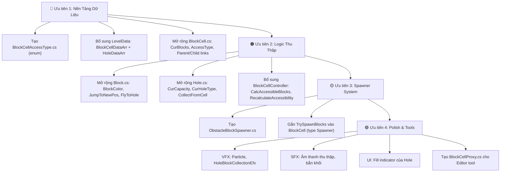

# 📋 Phân Tích Thiếu Sót: Tài Liệu Thiết Kế vs. Code Hiện Tại

> Tài liệu này so sánh 3 file thiết kế (`block_cell_priority_rules.md`, `block_cell_types_rules.md`, `hole_vs_blockcell_by_type.md`) với source code thực tế của project để xác định những gì **đã có**, **còn thiếu**, và **cần làm tiếp**.

---

## 📊 Tổng Quan Nhanh

| Hạng Mục | Tài Liệu Mô Tả | Code Hiện Tại | Trạng Thái |
|---|:---:|:---:|:---:|
| `BlockCellType` enum | ✅ 3 loại: Simple, Spawner, Accessible | ✅ Có (+ thêm `Empty`) | ✅ Khớp |
| `BlockCell` class | ✅ Mô tả đầy đủ | ⚠️ Chỉ có `PathDistForCollect` | 🔴 Thiếu nhiều |
| `Block` class | ✅ Mô tả `JumpToNewPos`, `SetAsTop` | ⚠️ Chỉ có `ParentHole` | 🔴 Thiếu nhiều |
| `BlockCellController` | ✅ Cần `CalcAccessibleBlocks`, accessibility DFS | ⚠️ Chỉ có `InitializeCellDistances` | 🔴 Thiếu logic chính |
| `BlockCellManager` | ✅ Cần `RecalculateAccessibility` | ❌ Không tồn tại | 🔴 Chưa tạo |
| `BlockCellAccessType` | ✅ Cần enum 3 trạng thái | ❌ Không tồn tại | 🔴 Chưa tạo |
| `Hole` – Thu thập khối | ✅ Cần `CurCapacity`, `CurHoleType`, màu sắc | ⚠️ Có `_ColorID`, `_holeCapacity` nhưng chưa thu thập | 🔴 Logic chưa có |
| `ObstacleBlockSpawner` | ✅ Mô tả `Strength`, hiệu ứng bắn | ❌ Không tồn tại | 🔴 Chưa tạo |
| Hiệu ứng VFX / SFX khi thu thập | ✅ Particle, sound, bounce | ❌ Không có | 🔴 Chưa tạo |
| Bezier curve bay khối | ✅ `JumpToNewPos` theo Bezier | ❌ Không có | 🔴 Chưa tạo |
| `BlockCellProxy` | ✅ Editor data proxy | ❌ Không tồn tại | 🔴 Chưa tạo |

---

## 🔴 Chi Tiết Các Thành Phần Còn Thiếu

---

### 1. `BlockCell.cs` — Thiếu phần lớn logic

**Hiện tại chỉ có:**
```csharp
public float PathDistForCollect;
public float GetPathDistForCollect();
```

**Cần bổ sung theo tài liệu:**

| Thuộc tính / Phương thức | Mô tả |
|---|---|
| `BlockCellType CurBlockCellType` | Loại ô (Simple / Spawner / Accessible) |
| `BlockCellAccessType AccessType` | Trạng thái truy cập (Accessible / ConnectedToAccessible / NotAccessible) |
| `List<Block> CurBlocks` | Danh sách khối đang chứa (chồng stack) |
| `Block TopBlock` | Khối đỉnh hiện tại |
| `int CurVisibleBlockCt` | Số khối hiển thị |
| `List<BlockCell> ParentBlockCells` | Các ô cha trong chuỗi phân cấp |
| `List<BlockCell> ChildBlockCells` | Các ô con trong chuỗi phân cấp |
| `int TopHoleType` | Màu sắc yêu cầu thu thập hiện tại |
| `void CollectBlocks(int count, Vector3 collectPoint)` | Xử lý khi Hole thu thập khối |
| `void UpdateTopBlock()` | Cập nhật khối đỉnh mới sau khi bị thu thập |
| `void TryPullBlocksFromParent()` | Kéo khối từ ô cha xuống lấp đầy |
| `void TrySpawnBlocks()` | Sinh khối mới (chỉ dùng cho BlockSpawner) |
| `int GetMatchingBlocksFromTop()` | Đếm số khối liên tiếp cùng màu từ đỉnh |
| `void SetAsTop()` | Đánh dấu khối là Top |

---

### 2. `Block.cs` — Gần như trống rỗng

**Hiện tại chỉ có:**
```csharp
private Hole ParentHole;
```

**Cần bổ sung:**

| Thuộc tính / Phương thức | Mô tả |
|---|---|
| `int BlockColor` | Màu sắc của khối |
| `bool IsTop` | Có phải khối đỉnh không |
| `void JumpToNewPos(Vector3 targetPos, float delay)` | Hoạt ảnh nhảy theo Bezier khi bị kéo/bắn sang ô khác |
| `void SetPathDistForCollect(float dist)` | Gán khoảng cách path để Hole có thể nhận diện |
| `void FlyToHole(Hole hole, float staggerDelay)` | Bay theo Bezier curve vào Hole khi bị thu thập |
| `void SetAsTop()` | Thiết lập trạng thái là khối đỉnh (hiển thị, bật collider...) |

---

### 3. `BlockCellAccessType` — **Chưa tồn tại**

Cần tạo file `BlockCellAccessType.cs`:

```csharp
public enum BlockCellAccessType
{
    Accessible,              // Hole có thể thu thập trực tiếp
    ConnectedToAccessible,   // Kết nối với ô Accessible, có thể được nâng cấp
    NotAccessible            // Bị cô lập, chưa kết nối
}
```

---

### 4. `BlockCellManager` / `BlockCellController` — Thiếu logic cốt lõi

**`BlockCellController` hiện tại chỉ có:**
- `InitializeCellDistances()` — Tính khoảng cách path ✅
- `GetCellByIndex()` — Lấy cell theo index ✅

**Cần bổ sung (hoặc tạo `BlockCellManager` riêng):**

| Phương thức | Mô tả |
|---|---|
| `CalcAccessibleBlocks(Hole hole)` | Tìm tất cả BlockCell có thể Hole thu thập tại thời điểm hiện tại (kiểm tra PathDist + màu + AccessType) |
| `RecalculateAccessibility()` | Chạy DFS/BFS từ các ô Accessible để cập nhật trạng thái `ConnectedToAccessible` cho các ô lân cận |
| `NotifyNeighbors(BlockCell cell)` | Gửi tín hiệu từ cell vừa trống để kích hoạt `RecalculateAccessibility` |
| `GetAllCellsOfType(BlockCellType type)` | Truy vấn danh sách cell theo loại |

> **Lưu ý**: Tài liệu gọi là `BlockCellManager`, code hiện tại dùng `BlockCellController`. Cần thống nhất tên hoặc phân chia trách nhiệm rõ ràng.

---

### 5. `ObstacleBlockSpawner.cs` — **Chưa tồn tại**

Cần tạo component riêng để quản lý logic bắn khối của `BlockSpawner`:

| Thuộc tính / Phương thức | Mô tả |
|---|---|
| `int Strength` | Số lượt bắn còn lại |
| `TMPro.TextMeshProUGUI StrengthText` | Text hiển thị số Strength trên màn hình |
| `float SpawnerDirectionAngleZ` | Góc bắn khối (đã có trong `BlockCellData`) |
| `GameObject SpawnerIndicator` | Hiển thị màu sắc khối sắp bắn |
| `void UpdateSpawnerStrength(int newStrength)` | Cập nhật Strength và UI |
| `void SpawnBlockSpawnerShootEfx()` | Phát hiệu ứng bắn |
| `bool CanSpawn()` | Kiểm tra còn Strength không |

---

### 6. `Hole.cs` — Thiếu logic thu thập chính

**Hiện tại có:**
- Di chuyển theo Bezier ✅
- Kiểm tra khoảng cách với BlockCell (bước đầu) ✅
- Hệ thống Spot ✅
- `_ColorID`, `_holeCapacity` (khai báo nhưng chưa dùng) ⚠️

**Cần bổ sung:**

| Thuộc tính / Phương thức | Mô tả |
|---|---|
| `int CurCapacity` | Sức chứa hiện tại (giảm dần khi thu thập) |
| `int CurHoleType` | Màu hiện tại của Hole (để so sánh với TopHoleType của BlockCell) |
| `void CollectFromCell(BlockCell cell)` | Gọi `CollectBlocks()` trên cell phù hợp |
| `void OnBlockArrived(Block block)` | Callback khi khối bay đến Hole (cập nhật CurCapacity, phát VFX/SFX) |
| `void StartVanishSequence()` | Khi `CurCapacity == 0`, bắt đầu chuỗi biến mất |
| `void PlayCollectionEfx()` | Phát hiệu ứng bounce/squish khi nhận khối |
| `void UpdateFillIndicator()` | Cập nhật UI fill bar |
| `bool IsFull()` | Kiểm tra `CurCapacity <= 0` |

---

### 7. `BlockCellProxy.cs` — **Chưa tồn tại**

Cần tạo để hỗ trợ Editor tool thiết kế màn chơi:

```csharp
[Serializable]
public class BlockCellProxy
{
    public BlockCellType CellType;
    public float SpawnerDirectionAngleZ;
    public List<BlockCellProxy> ChildCellProxies;
    public List<PendingBlockData> PendingBlocks;
}
```

---

### 8. `LevelData.cs` — Thiếu dữ liệu BlockCell

**Hiện tại chỉ có:**
```csharp
public int levelIndex;
public GameDifficult _gameDifficulty;
public Mesh _meshBezierSpline;
```

**Cần bổ sung:**
```csharp
public List<BlockCellData> BlockCellDataArr;   // Cấu hình tất cả BlockCell trong màn
public List<HoleData> HoleDataArr;             // Cấu hình các Hole trong màn
```

> `BlockCellData` đã có đầy đủ trường nhưng chưa được liên kết vào `LevelData`.

---

### 9. Hệ Thống VFX & SFX Khi Thu Thập — **Chưa có**

| Hiệu ứng | Mô tả | Trạng thái |
|---|---|---|
| Particle effect | Bùng nổ màu sắc khi khối vào Hole | ❌ Chưa có |
| Sound effect | Âm thanh "pop" khi thu thập | ❌ Chưa có |
| Bounce/Squish (`HoleBlockCollectionEfx`) | Hole co giãn khi nhận khối | ❌ Chưa có |
| Fill indicator update | Cập nhật thanh đầy của Hole | ❌ Chưa có |
| Spawner shoot effect | Hiệu ứng bắn của Spawner | ❌ Chưa có |

---

### 10. Hệ Thống Bay Khối Theo Bezier — **Chưa có**

Tài liệu mô tả khối bay theo **Bezier curve** với **stagger delay** (độ trễ lần lượt). Hiện tại `Block.cs` không có logic chuyển động nào.

**Cần:**
- Tích hợp BezierSolution (đã có trong project) để tạo đường bay cho từng `Block`.
- `staggerDelay`: Mỗi khối bay lần lượt, không đồng thời.
- Callback `onArrived` để thông báo cho Hole sau khi khối đến nơi.

---

## ✅ Những Gì Đã Có Và Hoạt Động Tốt

| Thành Phần | Trạng Thái | Ghi Chú |
|---|:---:|---|
| `BlockCellType` enum | ✅ | 4 loại (thêm `Empty` so với tài liệu) |
| `BlockCellData` struct | ✅ | Đầy đủ các trường |
| `PendingBlockData` | ✅ | `BlockCol` + `StackCt` |
| `HoleData` struct | ✅ | Đủ trường cơ bản |
| `Hole` — Di chuyển Bezier | ✅ | `BezierWalker`, tính khoảng cách thực |
| `Hole` — Hệ thống Spot | ✅ | `FlyToEmptySpot()`, `ShiftHolesForward()` |
| `BlockCellController` — Tính `PathDistForCollect` | ✅ | Tự động tính và sort theo spline |
| `LevelController` — Load/Save/Clone level | ✅ | Editor tools hoàn chỉnh |
| `StageController` — Vòng đời màn chơi | ✅ | Win/Lose/Restart/Next |
| `SpotsController` — Hàng chờ Hole | ✅ | `ShiftHolesForward` hoạt động |
| BezierSolution (thư viện) | ✅ | Đã tích hợp |
| LeanTween (thư viện animation) | ✅ | Dùng cho Spot movement |

---

## 🗺️ Lộ Trình Triển Khai Đề Xuất



---

## 📁 Tóm Tắt File Cần Tạo Mới

| File | Loại | Mô Tả |
|---|---|---|
| `BlockCellAccessType.cs` | Enum | 3 trạng thái: Accessible, ConnectedToAccessible, NotAccessible |
| `ObstacleBlockSpawner.cs` | MonoBehaviour | Logic bắn khối, quản lý Strength |
| `BlockCellProxy.cs` | Serializable class | Data proxy cho Editor tool |

## 📝 Tóm Tắt File Cần Sửa / Bổ Sung

| File | Thiếu Gì |
|---|---|
| `BlockCell.cs` | Gần như toàn bộ: stack, AccessType, Parent/Child, CollectBlocks, Pull, Spawn |
| `Block.cs` | BlockColor, JumpToNewPos, FlyToHole, SetAsTop |
| `Hole.cs` | CurCapacity, CurHoleType, CollectFromCell, OnBlockArrived, hiệu ứng |
| `BlockCellController.cs` | CalcAccessibleBlocks, RecalculateAccessibility, NotifyNeighbors |
| `LevelData.cs` | `BlockCellDataArr`, `HoleDataArr` |
